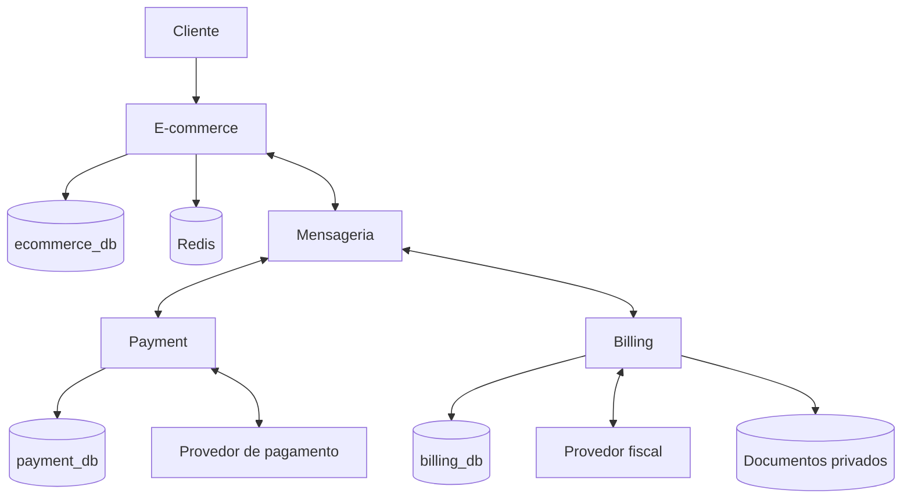

# E-Commerce API — Go

API de e-commerce em Go e núcleo de um ecossistema planejado com três serviços: **E-commerce**, **Payment** e **Billing**. Projeto de estudo e portfólio focado em engenharia de software, modelagem de domínio, consistência de dados, segurança e operação de sistemas distribuídos.

> **Estado atual:** protótipo parcial em retomada. Existe login e catálogo parcial (categorias, produtos e listagem de SKUs). Estoque, compras, pedidos e entregas possuem modelagem inicial, mas ainda não formam um fluxo de compra executável, conforme o diagnóstico versionado de 07/09/2026. Este README apresenta a arquitetura alvo e o plano de evolução. Funcionalidades planejadas não devem ser interpretadas como prontas ou homologadas para produção.

## Documentação e fonte de verdade

Antes de alterar código, consultar o diagnóstico técnico e o plano de execução existentes em `docs/project/`:

- [Diagnóstico técnico](./docs/project/01-diagnostico-atual.md): situação atual, lacunas, riscos e evidências.
- [Plano de execução](./docs/project/02-plano-de-execucao.md): sequência de trabalho e critérios de conclusão.
- [Engenharia reversa](./docs/project/03-engenharia-reversa-codigo-atual.md): structs, interfaces, métodos, dependências e fluxos do código executável atual.
- [Índice técnico](./docs/project/README.md): organização da documentação do projeto.

Este README consolida a visão alvo discutida para o projeto. O plano existente continua sendo a referência de execução: estabilizar o monólito modular, entregar cortes verticais e materializar serviços independentes gradualmente. As escolhas futuras deverão ganhar ADRs e contratos detalhados antes da implementação; esta atualização documental não conclui essas etapas. Arquivos Swagger gerados descrevem contratos HTTP; decisões arquiteturais e regras de negócio pertencem à documentação humana.

## Visão do produto

A primeira versão completa permitirá cadastrar clientes, gerenciar catálogo e preços, montar carrinhos, reservar estoque, criar pedidos, disponibilizar pagamento, acompanhar confirmação financeira, tratar cancelamentos e reembolsos, solicitar documentos fiscais e acompanhar entrega.

Premissas iniciais: loja de um vendedor, produtos físicos, BRL e um depósito. Marketplace, split entre vendedores, custódia de dinheiro, múltiplas moedas e múltiplos depósitos ficam fora do escopo inicial. A inclusão desses recursos exige revisão de requisitos e arquitetura.

## Arquitetura do ecossistema

| Serviço | Responsabilidade | Persistência alvo |
| --- | --- | --- |
| **E-commerce** — este projeto | Identidade, catálogo, preços, carrinho, estoque, pedidos e logística | PostgreSQL: `ecommerce_db` |
| **Payment** — planejado | Intenções e tentativas de pagamento, integração com PSP, confirmação financeira, reembolsos e conciliação | PostgreSQL: `payment_db` |
| **Billing** — planejado | Cobranças, vencimentos, solicitações de instrumentos de pagamento e documentos fiscais | PostgreSQL: `billing_db` |

Cada serviço possui seus dados, credenciais, migrações e ciclo de implantação. Nenhum serviço consulta diretamente as tabelas de outro. No desenvolvimento, os bancos podem compartilhar uma instância PostgreSQL com isolamento de permissões.

**Divisão do boleto:** Billing administra a cobrança e solicita o instrumento; Payment integra com o provedor e acompanha a liquidação. Billing recebe o resultado financeiro por contrato. Nota fiscal segue integração própria em Billing e não é equivalente a boleto ou comprovante de pagamento.



A implementação será sequencial: estabilização do E-commerce, contratos e integração simulada, Payment/Billing e operação integrada. O diagrama representa o destino arquitetural, não a infraestrutura atualmente verificada.

## Tecnologias

### Stack encontrada na base atual

Referências verificadas nesta revisão: `go.mod`, `docker-compose.yml`, `Makefile`, `cmd/api/main.go`, configuração e diagnóstico técnico. Inspeção estática não substitui execução de integração.

| Tecnologia | Uso |
| --- | --- |
| Go | Linguagem principal; `go.mod` declara Go 1.25.1 |
| Gin 1.11.0 | Transporte HTTP e composição de rotas |
| GORM 1.31.0 | Persistência relacional; regras comerciais ficam fora dos modelos de infraestrutura |
| PostgreSQL 13 no Compose atual | Fonte de verdade transacional |
| Redis 7 no Compose atual | Cache e mecanismos efêmeros com política de falha |
| JWT | Autenticação declarada; validação e ciclo de vida precisam de testes |
| Uber Zap 1.27.0 | Logging estruturado |
| Swaggo / gin-swagger | Geração e exposição da documentação HTTP |
| Prometheus / Grafana | Middleware Prometheus e serviços no Compose; provisionamento de dashboards/alertas ainda pendente |
| Docker / Docker Compose | Empacotamento e ambiente local |
| Make e scripts | Automação de desenvolvimento |

### Evolução proposta

| Tecnologia ou mecanismo | Objetivo | Estado |
| --- | --- | --- |
| RabbitMQ | Integração assíncrona entre serviços | Proposto; ainda não confirmado no repositório |
| Outbox e inbox no PostgreSQL | Publicação durável e deduplicação de mensagens | Planejado |
| OpenTelemetry | Tracing entre HTTP, workers e mensagens | Proposto; backend de traces a definir |
| Armazenamento privado de objetos | XML/PDF e outros documentos | Proposto; fornecedor a definir |
| Gitleaks | Detecção automatizada de segredos | Gate planejado |
| `govulncheck` | Análise de vulnerabilidades relevantes ao código Go | Gate planejado |
| CI no GitHub | Build, testes, contratos e segurança | Configuração atual a verificar |
| Adaptadores de PSP e serviço fiscal | Integrações externas substituíveis | Provedores a definir; começar com simuladores/sandbox |

Versões serão fixadas após validação de compatibilidade. O projeto não promete capacidade de tráfego, conformidade fiscal ou disponibilidade sem medições e validação específicas.

## Organização interna do E-commerce

| Caminho | Responsabilidade |
| --- | --- |
| `cmd/api/` | Inicialização da API e composição de dependências |
| `cmd/seed/` | Dados fictícios de desenvolvimento |
| `cmd/worker/` — planejado | Outbox, consumidores e tarefas duráveis |
| `internal/identity/` | Usuários, autenticação e endereços |
| `internal/catalog/` | Categorias, produtos, SKUs e preços |
| `internal/inventory/` — planejado | Estoque, reservas e movimentações |
| `internal/shopping/` — planejado | Carrinho e lista de desejos |
| `internal/checkout/` — planejado | Pedidos, totais, snapshots, cancelamento e logística |
| `internal/database/migrations/` | Evolução versionada do banco |
| `internal/shared/` | Configuração, conexões, cache, middleware e transporte compartilhado |
| `pkg/logger/` | Pacote de logging existente |
| `docs/project/` | Documentação técnica e decisões |
| `docs/` | Também contém artefatos gerados do Swagger |
| `deploy/` | Configurações de infraestrutura e observabilidade |
| `scripts/` | Rotinas auxiliares de desenvolvimento |
| `contracts/events/` — planejado | Schemas de mensagens e exemplos versionados |

Cada domínio pode conter `domain`, `service`, `repository` e `delivery/http`, preservando o padrão existente. Consumidores futuros podem ficar em `delivery/events`. A composição fica explícita nos pontos de entrada e nos arquivos de wiring.

### Regras de arquitetura

- **Domínio:** entidades, invariantes, estados e erros de negócio, sem dependência de Gin, GORM, Redis ou SDK de provedor.
- **Aplicação (`service`):** executa casos de uso e coordena autorização contextual, transações e portas.
- **Repositório:** implementa persistência e consultas parametrizadas.
- **Delivery:** converte HTTP/eventos em chamadas à aplicação e mapeia respostas/erros.
- **Infraestrutura compartilhada:** contém mecanismos técnicos, sem centralizar regras comerciais de diferentes domínios.

Aplicar SOLID, Clean Code e Clean Architecture por meio de interfaces pequenas, dependências explícitas e testes de comportamento. Evitar abstrações sem necessidade, repositórios genéricos universais e entidades compartilhadas entre todos os serviços.

## Dados e invariantes

| Contexto | Entidades principais |
| --- | --- |
| Identidade | Usuários e endereços |
| Catálogo | Categorias, produtos, SKUs e histórico de preços |
| Estoque | Saldos, reservas por pedido e movimentações |
| Compras | Carrinhos, itens e listas de desejos |
| Checkout | Pedidos, itens, snapshots de endereço, histórico e entregas |
| Payment | Intenções, tentativas, instrumentos, transações, reembolsos e conciliação |
| Billing | Cobranças, itens, documentos fiscais, eventos e arquivos |
| Integração | Outbox, inbox, idempotência e auditoria em cada serviço |

Regras obrigatórias:

1. Valores monetários usam inteiros na menor unidade da moeda, com moeda explícita e proteção contra overflow.
2. Preços e totais são calculados no servidor. O cliente não determina o valor final da cobrança.
3. Pedidos preservam snapshots de itens e endereços; alterações cadastrais não reescrevem a compra antiga.
4. Estoque reservado nunca supera o estoque físico. A reserva de todos os itens do pedido é atômica.
5. Carrinho não garante disponibilidade. Estoque é reservado no checkout.
6. Repetir checkout, cobrança ou reembolso com a mesma identidade de operação não duplica seu efeito.
7. Autorização financeira não é captura; retorno do navegador não confirma pagamento.
8. Reembolsos concluídos e em andamento não podem exceder o valor capturado.
9. Pedidos e transações preservam histórico; cancelamento não é exclusão genérica.
10. Nenhuma chamada a provedor ocorre dentro de uma transação SQL aberta.

O SQL existente precisa evoluir para proteger essas invariantes, incluindo reservas explícitas, unicidades, snapshots, políticas de exclusão e índices. Migrações aplicadas não devem ser reescritas em ambientes compartilhados.

## Fluxo completo planejado

1. Cliente autentica, consulta catálogo e monta carrinho.
2. E-commerce valida preços/endereço e grava pedido, snapshots, reserva e evento outbox na mesma transação.
3. Billing recebe o pedido, registra a cobrança e solicita a intenção de pagamento.
4. Payment persiste a operação e integra com o PSP usando chave estável de idempotência.
5. O instrumento fica disponível para o cliente por consulta autorizada.
6. Payment recebe e valida webhook, persiste o recebimento e confirma o estado financeiro.
7. E-commerce consome a confirmação e conclui a alocação de estoque; Billing atualiza a cobrança.
8. E-commerce solicita o documento fiscal quando a política da operação determinar. Billing processa emissão e disponibiliza os arquivos com acesso restrito.
9. O pedido segue para expedição e entrega conforme os requisitos comerciais e fiscais.

### Falhas e compensações

| Cenário | Tratamento esperado |
| --- | --- |
| Mensagem duplicada | Inbox e restrições de negócio impedem efeito duplicado |
| Broker indisponível | Outbox mantém trabalho pendente |
| PSP processa e resposta se perde | Consultar por referência estável antes de tentar criar novamente |
| Pagamento após expiração | Reavaliar estoque; confirmar excepcionalmente ou solicitar reembolso auditável |
| Cancelamento concorrente com captura | Serializar decisão local e executar compensação quando necessária |
| Webhook fora de ordem | Validar estado/versão e reconciliar com autoridade financeira |
| Emissão fiscal rejeitada | Registrar pendência e bloquear expedição quando a política exigir |
| Redis indisponível | Preservar consistência no PostgreSQL e limitar carga da degradação |

A entrega de mensagens será pelo menos uma vez. Idempotência, ordenação por agregado quando necessária e reconciliação fazem parte do desenho; não há promessa de transação única envolvendo todos os serviços.

## Contratos e documentação da API

A API atual usa `/api/v1`; a evolução preservará esse prefixo para evitar quebra desnecessária. A arquitetura usa HTTP versionado e contratos internos autenticados. Eventos terão schemas versionados, identidade única, produtor, agregado, versão, instante e correlação.

O diagnóstico registra login em `POST /api/v1/auth/login`, CRUD parcial de categorias/produtos e listagem em `GET /api/v1/skus`. O bootstrap registra Swagger, Redoc, health checks e middleware de métricas. Swagger ainda precisa ser reconciliado com as respostas reais e a rota de SKU.

Padrões planejados: erros estáveis, paginação limitada, autorização por proprietário/papel, limites de corpo, deadlines, request ID e idempotência nas operações críticas. Documentar respostas assíncronas e falhas, além do caminho de sucesso.

## Desenvolvimento local

Pré-requisitos: Go compatível com `go.mod` (1.25.1), Git, Docker com Compose, Make e CLI `migrate` do golang-migrate com suporte PostgreSQL. Para gerar Swagger, o target atual exige `swag`; alinhar a versão ao projeto (dependência Swaggo 1.16.6).

```bash
git clone https://github.com/EdsonJunio/e-commerce-go.git
cd e-commerce-go

# Iniciar somente as dependências da API local.
docker compose up -d db redis
```

O pacote de configuração carrega `.env.local` e depois `.env`, sem substituir variáveis já definidas no ambiente. Configurar os campos abaixo com valores compatíveis com o ambiente local; não versionar credenciais:

| Variável | Uso |
| --- | --- |
| `APP_ENVIRONMENT` | Ambiente; o padrão atual é `development` |
| `SERVER_PORT` | Porta HTTP; padrão 8081 |
| `DB_HOST`, `DB_PORT` | Endereço PostgreSQL; no host local, localhost e porta publicada |
| `DB_USER`, `DB_PASSWORD`, `DB_NAME`, `DB_SSLMODE` | Conexão PostgreSQL |
| `REDIS_HOST`, `REDIS_PORT`, `REDIS_PASSWORD`, `REDIS_DB` | Conexão Redis |
| `CORS_ALLOW_ORIGINS` | Origens permitidas |

Após o PostgreSQL estar saudável, definir `DB_URL` no terminal com a URL do banco local e aplicar as migrações. Esse parâmetro pertence ao Makefile; a API usa as variáveis `DB_*` acima. O argumento explícito evita usar o valor fixo atual do Makefile.

```bash
make migrate-up DB_URL="$DB_URL"
go run ./cmd/api
```

O Compose atual e o Makefile contêm credenciais fixas de desenvolvimento; sua externalização faz parte da estabilização. Não usar essa configuração em ambientes compartilhados ou produção. O diagnóstico também aponta segredo JWT fixo e autorização administrativa insuficiente: configurar variáveis de banco não corrige esses problemas. Não expor esta base publicamente antes de resolvê-los.

| Recurso local | Endereço padrão |
| --- | --- |
| Swagger | http://localhost:8081/swagger/index.html |
| Redoc | http://localhost:8081/docs |
| Liveness | http://localhost:8081/live |
| Readiness | http://localhost:8081/ready |
| Métricas | http://localhost:8081/metrics |

Para regenerar a documentação HTTP:

```bash
make docs
```

O target executa `swag init -g cmd/api/docs.go --output docs --parseDependency --parseInternal`. Não editar os arquivos gerados manualmente.

Prometheus e Grafana existem no Compose. Iniciar esses serviços pelo Compose também aciona suas dependências, incluindo a API em container; não manter simultaneamente outra API local na porta 8081. O provisionamento de datasource, dashboards e alertas é trabalho futuro. O seed atual pode limpar dados e não deve ser executado automaticamente como parte do setup.

Essas instruções foram reconciliadas estaticamente com os arquivos, mas não foi executado um teste completo de subida nesta revisão documental.

## Testes e qualidade

A cobertura deve demonstrar comportamento correto, especialmente nas fronteiras transacionais e financeiras.

| Nível | Verificação |
| --- | --- |
| Unitário | Invariantes, totais, estados e erros |
| Aplicação | Autorização, idempotência, rollback e coordenação |
| Integração PostgreSQL | Migrações, constraints, locks e transações reais |
| Concorrência | Último item, expiração contra captura e reembolsos simultâneos |
| HTTP e contratos | Payloads, acesso entre usuários, erros e compatibilidade |
| E2E | Compra completa com provedores simulados |
| Recuperação | Restart de worker, replay, conciliação e restauração |

Gates planejados: formatação, `go vet`, testes, detector de corridas, análise de vulnerabilidades, scanner de segredos e verificação de Swagger/contratos. Os scripts existentes devem ser inspecionados antes de declarar esses gates ativos.

## Segurança e observabilidade

- Autenticação e autorização por recurso; privilégios mínimos para usuários, serviços e bancos.
- Segredos externos ao código e logs, com rotação e detecção em alterações e histórico relevante.
- Verificação de assinatura e replay de webhooks conforme o provedor.
- Sem armazenamento de PAN/CVV; integração tokenizada/hospedada quando aplicável.
- Documentos e dados pessoais com acesso restrito e política de retenção.
- Logs estruturados sem credenciais e sem payload pessoal indiscriminado.
- Métricas de HTTP, banco, reservas, outbox, retries, DLQ, conciliação e emissão fiscal.
- Tracing distribuído planejado, health checks, shutdown controlado e runbooks.
- Backups e restauração ensaiada antes de declarar prontidão operacional.

O middleware de métricas está conectado ao router; `/live` e `/ready` estão registrados. A readiness atual verifica PostgreSQL. Dashboards, alertas, métricas de negócio e tracing precisam de implementação/validação. Desempenho e disponibilidade serão medidos com carga representativa.

## Roadmap até a primeira versão completa

- [ ] Validar diagnóstico, código, migrações e comandos atuais.
- [ ] Estabilizar build, configuração, testes e gates de segurança.
- [ ] Consolidar identidade e autorização.
- [ ] Consolidar catálogo, preços, persistência e cache.
- [ ] Implementar estoque e reservas concorrentes.
- [ ] Implementar shopping: carrinho e favoritos.
- [ ] Implementar checkout com snapshots, totais e idempotência.
- [ ] Implementar outbox, inbox e contratos versionados.
- [ ] Implementar cobrança em Billing e integração simulada.
- [ ] Implementar Payment, webhooks e conciliação.
- [ ] Implementar expiração, cancelamento e reembolsos.
- [ ] Integrar provedor fiscal e documentos privados.
- [ ] Concluir logística, jornadas E2E e cenários de falha.
- [ ] Validar carga, alertas, backup e recuperação.

Os itens representam marcos a comprovar; não medem automaticamente a porcentagem já implementada. Provedor de pagamento, modalidade fiscal, política de reserva para boleto e infraestrutura de produção ainda precisam de decisões específicas.

## Disciplina de evolução

Cada alteração deve conter código, testes pertinentes e atualização documental. Registrar propósito dos arquivos/packages alterados, regras, efeitos externos, erros e evidências de verificação. Atualizar Swagger e schemas quando o contrato mudar.

Trabalhar em entregas pequenas, com commits identificáveis e push para branch de trabalho após os gates. Decisões arquiteturais ficam registradas em ADRs, com contexto, alternativas e consequências. O README apresenta a visão geral; documentação detalhada e código devem permanecer consistentes.

A primeira versão estará concluída quando a jornada completa e suas compensações estiverem implementadas, testadas e operáveis, dentro das premissas declaradas.

## Histórico desta revisão

11/09/2026 — README reestruturado para distinguir a base parcial da arquitetura alvo; adicionados ownership das três APIs, stack atual/proposta, módulos futuros, regras de dados, fluxo completo, resiliência, segurança, roadmap e instruções locais conciliadas com configuração e Makefile. Nenhuma funcionalidade de aplicação foi implementada por esta atualização.
