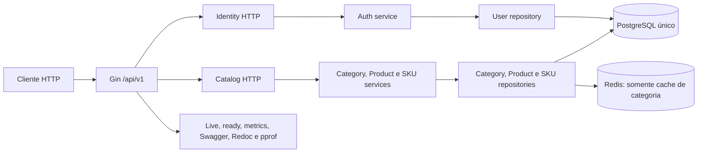
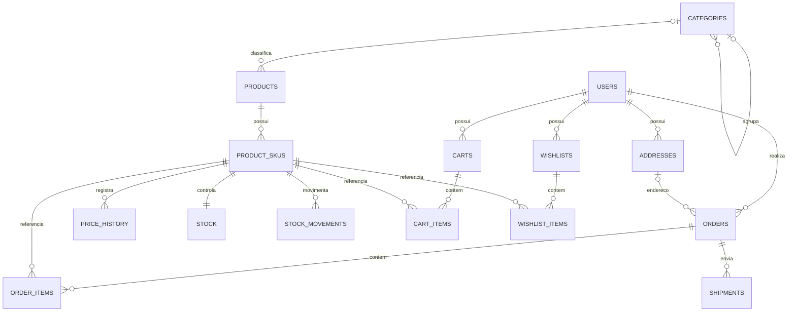

# Diagnóstico do estado atual

Data da análise: 2026-09-07

Commit analisado: `e74975d` (`main`)
Escopo: código Go, migrations, seed, configuração, documentação, testes, scripts, Docker e histórico recente do repositório.

## 1. Conclusão executiva

O projeto está no estágio de **protótipo técnico compilável com um catálogo parcial**, anterior a um MVP de e-commerce. Existe uma base útil: a aplicação possui bootstrap para PostgreSQL e Redis, oferece login, CRUD de categorias e produtos, lista SKUs, expõe health checks, métricas e Swagger, e prevê encerramento controlado. A inicialização completa com as dependências reais ainda precisa de um teste de integração.

Ainda não existe um fluxo de compra executável. Cliente, endereço, estoque, carrinho, wishlist, pedido e entrega possuem tabelas e dados de exemplo, mas não possuem módulos de aplicação nem endpoints. Payment API e Billing/Fiscal API não existem no repositório. Também não há mensageria, eventos, idempotência, outbox, saga, tracing, CI ou testes significativos.

A estrutura por módulos é um começo válido, mas a afirmação atual de Clean Architecture é maior do que o código sustenta. O domínio depende de GORM, o pacote compartilhado conhece erros do catálogo, a configuração é carregada mais de uma vez e a composição manual convive com código Wire sem uso. Antes de adicionar novos domínios, o projeto precisa de uma decisão arquitetural explícita e de uma curta etapa de estabilização.

## 2. Como a análise foi feita

Foram inspecionados todos os arquivos versionados, as 42 fontes Go, as três migrations `up` e respectivas reversões, o seed, o contrato Swagger, os scripts e os arquivos de infraestrutura. Também foram executadas as validações disponíveis.

Limites desta análise:

- Não foi iniciado um PostgreSQL nem aplicado o conjunto de migrations em um banco limpo. A validade SQL foi avaliada estaticamente.
- Não foram executados testes de integração HTTP, PostgreSQL ou Redis porque eles não existem.
- O diagnóstico descreve o commit informado acima. Mudanças posteriores devem atualizar esta data e as evidências.

## 3. Arquitetura encontrada

O repositório contém um único executável de API e um executável de seed. A API é organizada por módulo de negócio e por camada interna.

### Pontos positivos da base

- Organização inicial por `identity`, `catalog` e `shared`.
- Separação visível entre handler HTTP, serviço e repositório no catálogo.
- Uso de `context.Context` nas operações do catálogo.
- Erros de domínio para categorias e produtos e mapeamento HTTP centralizado.
- Migrations SQL versionadas e sem `AutoMigrate` em tempo de execução.
- Logs estruturados com Zap, request ID, recovery e encerramento controlado.
- Timeouts do servidor HTTP, pool de conexões e timeouts do Redis configurados.
- API versionada em `/api/v1`, health checks, métricas Prometheus e Swagger.
- Imagem final Docker mínima e executada com usuário sem privilégios.

### Limites arquiteturais atuais

- É um monólito modular parcial, não um conjunto de microsserviços.
- Tipos de domínio importam GORM e contêm tags de persistência, acoplando domínio e banco.
- Interfaces de repositório e de serviço ficam agrupadas no domínio, inclusive quando são consumidas por outra camada.
- `internal/shared/transport` importa erros de `catalog`, criando dependência de código compartilhado para um módulo específico.
- `main.go` faz composição manual; `internal/catalog/wire.go` existe, mas não é gerado nem usado e não descreve todas as dependências necessárias.
- O repositório de categoria depende diretamente de um cliente Redis concreto, o que dificulta substituição, teste e política de degradação.
- A configuração é carregada no `main`, novamente na conexão e novamente no pool, em vez de ser validada uma vez e injetada.

## 4. Funcionalidades encontradas

“Implementado” abaixo significa que existe um caminho HTTP ou operacional executável. Uma tabela ou um seed isolado é classificado como modelagem inicial.

| Área | Estado | Evidência e observação |
| --- | --- | --- |
| Login por e-mail e senha | Parcial | `POST /api/v1/auth/login`, bcrypt e emissão de JWT; não há cadastro, refresh, logout ou recuperação de senha |
| Autenticação de rotas | Parcial | Middleware Bearer nas mutações de catálogo |
| Autorização administrativa | Ausente | O token contém `is_admin`, mas nenhuma rota exige esse papel |
| Categorias | Parcial | Listar, buscar por ID/slug, criar, atualizar e excluir; há erros de filtro, atualização e cache descritos adiante |
| Produtos | Parcial | Listar, buscar por ID/slug, criar, atualizar e excluir; há erros de filtro e atualização |
| SKUs | Inicial | Somente listagem pública; sem busca, criação, atualização ou exclusão e com divergência de schema |
| Cache | Parcial | Cache-aside de categoria por ID/slug com Redis; invalidação incompleta |
| Usuários e endereços | Somente modelagem | Tabelas e seed; apenas usuário é lido no login |
| Preço e histórico de preço | Somente modelagem | Tabela e seed sem caso de uso |
| Estoque e movimentações | Somente modelagem | Tabelas e seed sem reserva, baixa, liberação ou API |
| Carrinho e wishlist | Somente modelagem | Tabelas e seed sem domínio ou API |
| Pedido e entrega | Somente modelagem | Tabelas e seed sem domínio ou API |
| Payment API | Ausente | Nenhum executável, módulo, tabela ou contrato |
| Billing/Fiscal API | Ausente | Nenhum executável, módulo, tabela ou contrato |
| Eventos e mensageria | Ausente | Nenhum broker, produtor, consumidor, outbox ou contrato |
| Observabilidade | Parcial | Logs e métricas HTTP genéricas; não há tracing, métricas de negócio ou alertas provisionados |
| Documentação HTTP | Parcial | Swagger cobre login, categoria e produto; SKU e rotas operacionais não estão documentados |

### Endpoints de negócio existentes

| Método | Rota | Proteção | Situação |
| --- | --- | --- | --- |
| POST | `/api/v1/auth/login` | Pública | Parcialmente funcional |
| GET | `/api/v1/categories` | Pública | Filtros informados são ignorados |
| GET | `/api/v1/categories/:id` | Pública | Implementado |
| GET | `/api/v1/categories/slug/:slug` | Pública | Implementado com cache |
| POST | `/api/v1/categories` | Qualquer JWT válido | Implementado, sem autorização por papel |
| PUT | `/api/v1/categories/:id` | Qualquer JWT válido | Pode desativar o registro sem solicitação |
| DELETE | `/api/v1/categories/:id` | Qualquer JWT válido | Soft delete via GORM; cache por slug pode permanecer |
| GET | `/api/v1/products` | Pública | Filtros informados são ignorados |
| GET | `/api/v1/products/:id` | Pública | Implementado |
| GET | `/api/v1/products/slug/:slug` | Pública | Implementado |
| POST | `/api/v1/products` | Qualquer JWT válido | Implementado, sem autorização por papel |
| PUT | `/api/v1/products/:id` | Qualquer JWT válido | Pode desativar o registro sem solicitação |
| DELETE | `/api/v1/products/:id` | Qualquer JWT válido | Soft delete via GORM |
| GET | `/api/v1/skus` | Pública | Listagem inicial; não aparece no Swagger |

Rotas operacionais existentes: `/live`, `/ready`, `/metrics`, `/swagger/*`, `/docs` e, por padrão fora de produção, `/debug/pprof`.

## 5. Funcionalidades necessárias e ausentes

### E-commerce

- Cadastro e gestão de cliente, endereço e consentimentos.
- Gestão completa de SKU, preço e histórico de preço.
- Entrada, ajuste, reserva, confirmação e liberação de estoque.
- Carrinho com itens, expiração, validação de preço e disponibilidade.
- Checkout e criação transacional do pedido com fotografia dos itens, preços e endereços.
- Máquina de estados de pedido, histórico, cancelamento e integração com pagamento.
- Autorização por papel/permissão e auditoria de operações administrativas.

### Pagamento

- Serviço, armazenamento e contrato próprios.
- Criação idempotente de tentativa de pagamento.
- Estados pendente, processando, aprovado, recusado, cancelado, estornado e falha técnica.
- Histórico imutável de transações e tentativas, conciliação e estorno.
- Callback/webhook autenticado e entrega confiável do resultado.
- Simulador de adquirente com timeout, retry e resultados determinísticos para testes.

### Cobrança e fiscal

- Serviço, armazenamento e contrato próprios.
- Cobrança e geração de boleto simulada, com vencimento e estados.
- Solicitação, autorização, rejeição e cancelamento de documento fiscal.
- Consulta e histórico dos documentos e integrações externas substituíveis.
- Idempotência e reprocessamento seguro.

### Capacidades transversais

- Contratos OpenAPI coerentes com a resposta real e contratos de eventos versionados.
- Testes unitários, de integração, de contrato e de fluxo principal.
- Tracing distribuído, métricas de negócio e correlação entre serviços.
- CI com formatação, análise estática, testes, build, migrations e validação de contratos.
- Estratégias documentadas de backup, restore, retenção, proteção de dados e segredos.

## 6. Problemas e dívidas técnicas

### Críticos

| ID | Problema | Impacto | Recomendação |
| --- | --- | --- | --- |
| DIA-001 | A chave JWT é fixa no código e o parâmetro de configuração recebido é ignorado | Qualquer pessoa com acesso ao código pode emitir tokens válidos; não há rotação por ambiente | Exigir segredo por variável/secret manager, validar tamanho no startup e preparar rotação de chave |
| DIA-002 | Toda pessoa autenticada pode criar, alterar e excluir produtos e categorias; `is_admin` é calculado por `user.ID == 1` | Escalada de privilégio e corrupção do catálogo | Modelar papéis/permissões no banco e aplicar middleware/policy de autorização às rotas administrativas |

### Altos

| ID | Problema | Impacto | Recomendação |
| --- | --- | --- | --- |
| DIA-003 | Atualizações parciais sempre copiam o valor zero de `IsActive` no domínio | Alterar nome, slug ou descrição pode desativar produto ou categoria silenciosamente | Preservar presença do campo com comando/DTO de atualização explícito e testar `true`, `false` e campo omitido |
| DIA-004 | Handlers criam chaves como `"is_active = ?"`, mas repositórios procuram `"is_active"`; ocorre também com categoria, produto e SKU | Filtros válidos são ignorados sem erro | Substituir mapas frágeis por filtros tipados e validar parâmetros inválidos |
| DIA-005 | `Product_skus` declara coluna `stock`, inexistente em `product_skus`; o estoque real está em `stock`. O filtro usa `sku_id`, também inexistente na tabela | Resposta de estoque incorreta e possível SQL inválido quando o filtro for corrigido parcialmente | Renomear o tipo para `ProductSKU`, separar estoque e consultar por `id`/`product_id` de forma explícita |
| DIA-006 | Cache de categoria não invalida o slug anterior em update nem o slug em delete | Leituras por slug podem devolver dados antigos ou excluídos por até dez minutos | Buscar/guardar chave anterior e invalidar todas as representações; testar falhas do Redis e consistência |
| DIA-007 | Não existem testes de regras de negócio ou integração; cobertura total medida em 1,5% | Regressões nos fluxos principais não são detectadas | Criar testes focados em domínio/serviço e integração com PostgreSQL/Redis antes de expandir funcionalidades |
| DIA-008 | O seed usa DSN e senhas fixos e começa com `TRUNCATE ... CASCADE` | Execução contra o banco errado destrói dados | Usar configuração explícita, bloquear ambientes não locais e exigir uma opção consciente para limpeza |
| DIA-009 | Não existe `.dockerignore`, embora o Dockerfile faça `COPY . .` | `.git`, arquivos locais e possíveis `.env` entram no contexto e no cache de build | Criar `.dockerignore` antes de usar builds fora da máquina local |
| DIA-010 | O Docker Compose não define `APP_ENVIRONMENT`; o padrão é development e habilita pprof | `/debug/pprof` fica exposto pela porta publicada da API no ambiente Docker | Definir ambiente explicitamente e exigir habilitação explícita de pprof |

### Médios

| ID | Problema | Impacto | Recomendação |
| --- | --- | --- | --- |
| DIA-011 | `APP_ENVIRONMENT`, `APP_ENV`, `SCOPE` e configurações hardcoded são usados em lugares diferentes | Comportamento local e Docker divergem e a configuração fica difícil de prever | Carregar e validar uma configuração única; eliminar aliases não usados |
| DIA-012 | O comentário promete backoff exponencial, mas a espera é linear e usa `time.Sleep` não cancelável | Inicialização pode ultrapassar o timeout e atrasar shutdown/deploy | Usar timer cancelável, política limitada e métricas/logs coerentes |
| DIA-013 | Redis é necessário para iniciar a API, embora seja apenas cache, e não participa do readiness | Indisponibilidade do cache derruba o serviço no boot, mas depois não altera o health check | Definir política: cache opcional com degradação ou dependência obrigatória refletida no readiness |
| DIA-014 | Erros obrigatórios de descrição e SEO não estão todos no mapper; slug vazio de categoria retorna erro de descrição | Entradas inválidas podem virar HTTP 500 e códigos errados | Completar catálogo de erros e cobrir o mapeamento com testes de tabela |
| DIA-015 | A validação customizada de slug nunca é registrada e os DTOs não usam a tag `slug` | Slugs fora do padrão chegam ao domínio/banco | Registrar validações no bootstrap ou validar no domínio com erros estáveis |
| DIA-016 | O repositório de usuário não recebe contexto e converte erro de domínio em string genérica | Cancelamento, timeout e classificação de erro ficam inconsistentes | Aceitar contexto e usar erros sentinela próprios de identity |
| DIA-017 | Handlers repetem parsing, logging e mapeamento, ignoram erro ao reler após update e chegam a mais de 400 linhas | Inconsistência e manutenção cara | Extrair apenas helpers estáveis e usar DTOs/mappers; tratar todos os erros retornados |
| DIA-018 | Swagger documenta 13 operações, não inclui SKU/health, e descreve respostas sem o envelope `data` usado em runtime | Consumidores recebem contrato incorreto | Tratar OpenAPI como contrato validado em CI e adicionar testes de contrato |
| DIA-019 | README possui claims de robustez e módulos que não correspondem ao estado executável; o diagrama referenciado não existe | Induz mantenedor e usuário a conclusões erradas | Manter status e documentos manuais ligados ao README e revisar instruções após estabilização |
| DIA-020 | Makefile possui dois alvos `air`, referencia `.air.toml` inexistente e exporta `SCOPE`, que a aplicação ignora | Hot reload e execução local não são reproduzíveis | Manter um alvo, versionar a configuração necessária e alinhar variáveis |
| DIA-021 | `go.mod.save`, Wire não utilizado, mocks sem testes e dependências de teste sem uso indicam resíduos de abordagens anteriores | Aumentam ruído e custo de manutenção | Confirmar uso e remover apenas em uma etapa de limpeza com build/teste antes e depois |
| DIA-022 | A imagem final é mínima, mas imagens do Compose usam tags `latest` e Grafana/Prometheus não têm provisionamento nem persistência declarada | Ambiente local muda sem controle e perde configuração | Fixar versões e provisionar datasource/dashboard/volumes quando observabilidade for trabalhada |

### Baixos ou de consistência

- Nomes Go não idiomáticos (`Product_skus`, `SkuCode`, `BarCode`) e ordem de imports inconsistente em alguns arquivos.
- `ErrInvalidProductPrice` possui mensagem de descrição e não é usado; `ErrParentCategoryRequired` também não é usado.
- Campos JSON misturam `seoTitle` na entrada com `seo_title` na saída.
- `is_active` obrigatório como `bool` no create de produto impede expressar `false` corretamente com a validação atual.
- Categoria exige descrição no domínio, mas esse requisito não aparece no DTO/Swagger como obrigatório.
- `package.json`/Husky convive com scripts próprios de hooks sem diretório `.husky`, adicionando uma segunda estratégia incompleta.
- A página Redoc depende de CDN externa, portanto a documentação local não é totalmente offline.

## 7. Avaliação da modelagem de dados atual

Há 15 tabelas em um único PostgreSQL. Elas antecipam boa parte do e-commerce, mas ainda representam um rascunho estrutural, sem regras de aplicação que controlem transições e invariantes.

### Acertos

- Valores monetários usam inteiros em centavos.
- Pedido guarda o preço do item, evitando depender do preço atual do SKU.
- Há checks básicos de quantidade e preço e chaves estrangeiras para relações principais.
- Estoque físico e reservado são separados e existe uma tabela de movimentos.
- Histórico de preço está separado do preço corrente.
- Timestamps usam `TIMESTAMPTZ`.

### Lacunas e riscos do schema

- Não há índices explícitos para a maioria das chaves estrangeiras e consultas esperadas. PostgreSQL não cria esses índices automaticamente.
- `reserved_quantity` pode ser maior que `quantity`; falta uma restrição ou definição inequívoca do significado de `quantity`.
- Não há unicidade para carrinho ativo por usuário, wishlist por usuário, SKU por carrinho/wishlist ou entrega por pedido. Duplicatas são possíveis.
- Endereços do pedido apontam para registros mutáveis do cliente. Um pedido precisa preservar uma fotografia do endereço usado.
- Não há histórico de estados do pedido, motivo da transição, ator ou versão para concorrência.
- O estado do pedido mistura pagamento (`paid`, `refunded`, `failed`) com ciclo comercial. Isso acopla domínios que precisarão evoluir separadamente.
- Não há reserva de estoque com identificador, expiração, estado e chave idempotente.
- `stock_movements.reference_id` não informa o tipo da referência e campos de ator não têm integridade referencial.
- Soft delete e `UNIQUE` simples impedem reutilizar e-mail/slug após exclusão; a política ainda não foi decidida.
- Cascatas de delete convivem com soft delete, mas seus efeitos e requisitos de retenção não estão definidos.
- Categorias impedem apenas autorreferência na aplicação; ciclos com vários níveis continuam possíveis.
- A migration aceita produto sem categoria, enquanto a validação Go exige categoria.
- Moeda é texto livre, sem tamanho/check, e não existe política de arredondamento ou múltiplas moedas.
- Pagamentos, cobranças, documentos fiscais, idempotency keys, outbox, inbox e trilha de auditoria não estão modelados.
- Não há plano documentado de backup, restore, retenção ou teste de recuperação.

Qualquer mudança deve ser feita por nova migration enquanto houver possibilidade de bancos existentes. Reescrever migrations antigas só deve ser considerado se for confirmado que não existe ambiente ou dado a preservar.

## 8. Qualidade dos testes e validações

Existem dois arquivos de teste:

- `internal/catalog/delivery/http/product_handler_test.go`: teste vazio, sem arrange, chamada ou assert.
- `pkg/logger/example_test.go`: smoke tests que exercitam o logger; a maior parte não possui assert sobre a saída ou os campos.

Há mocks gerados de produto, mas nenhum teste os usa. Não há testes de categoria, produto, SKU, login, JWT, middleware, repositório, migration, cache ou API. Também não há testes de integração, contrato ou ponta a ponta.

Resultados observados:

| Validação | Resultado |
| --- | --- |
| `gofmt -l` | Sem arquivos reportados |
| `go vet ./...` | Passou |
| `go test ./...` | Passou após baixar três dependências ausentes do cache |
| Cobertura de statements | **1,5% total**; 31,7% em `pkg/logger`; 0% nos módulos de negócio |
| `docker compose config -q` | Válido, com aviso de que o campo `version` é obsoleto |
| OpenAPI gerado | 13 operações; rota de SKU ausente |
| CI | Nenhum workflow versionado |

O resultado de `go test` comprova compilação e execução dos poucos testes existentes. Ele não comprova as regras de negócio nem o funcionamento com PostgreSQL e Redis.

## 9. Riscos técnicos consolidados

| Risco | Probabilidade | Impacto | Tratamento inicial |
| --- | --- | --- | --- |
| Token forjado ou acesso administrativo indevido | Alta | Crítico | Segredo externo, configuração validada e RBAC |
| Regressão silenciosa em catálogo | Alta | Alto | Corrigir atualização/filtros e adicionar testes |
| Dados inconsistentes em estoque e pedidos futuros | Alta | Alto | Definir invariantes e transações antes de criar endpoints |
| Ambiente local não reproduzível | Média | Alto | Alinhar Compose, Makefile, env, migrations e seed seguro |
| Cache devolver categoria antiga/excluída | Alta | Médio | Corrigir invalidação e definir degradação |
| Contrato Swagger divergir da implementação | Alta | Médio | Validar OpenAPI e contratos em CI |
| Extrair microsserviços cedo demais | Média | Alto | Decidir fronteiras e custos em ADR antes de criar executáveis |
| Falhas distribuídas gerarem duplicidade | Alta quando houver integração | Crítico | Idempotência desde os primeiros comandos; outbox/inbox quando houver eventos reais |
| Perda de histórico financeiro/fiscal | Alta se a modelagem atual for estendida diretamente | Crítico | Ledgers/históricos imutáveis e auditoria nos serviços responsáveis |

## 10. Melhorias recomendadas

1. Tomar e registrar a decisão arquitetural antes de criar Payment e Billing. A hipótese mais coerente para avaliação é começar o e-commerce como monólito modular e só separar processos com autonomia e falhas próprias; ela ainda precisa ser comparada formalmente com três serviços desde o início.
2. Estabilizar segurança e correção do que já existe: segredo JWT, autorização, updates parciais, filtros, SKU, cache e catálogo de erros.
3. Criar uma base de testes que proteja essas correções e um teste de integração que aplique migrations em PostgreSQL real.
4. Tornar execução local reproduzível e segura: configuração única, `.dockerignore`, Compose versionado, seed protegido e comandos coerentes.
5. Definir contextos, estados e contratos antes de ampliar o schema. Estoque, pedido, pagamento e cobrança precisam de invariantes e idempotência desde o primeiro caso de uso.
6. Implementar um fluxo vertical por vez, começando no e-commerce e avançando até pedido criado, sem introduzir mensageria antes de existir comunicação entre processos que a justifique.
7. Introduzir Payment e Billing com bancos próprios e contratos explícitos. Eventos, outbox/inbox e consistência eventual entram quando esses limites estiverem materializados.

## 11. Próximo passo

O próximo passo é a etapa de definição arquitetural. Ela deve comparar monólito modular, três microsserviços e uma evolução híbrida; avaliar REST, gRPC, filas e eventos; definir contextos e propriedade dos dados; e terminar com um ADR aceito. Nenhuma refatoração estrutural deve começar antes dessa decisão.

O plano detalhado e os critérios de conclusão estão em [02-plano-de-execucao.md](./02-plano-de-execucao.md).
