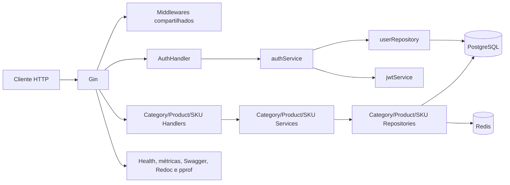
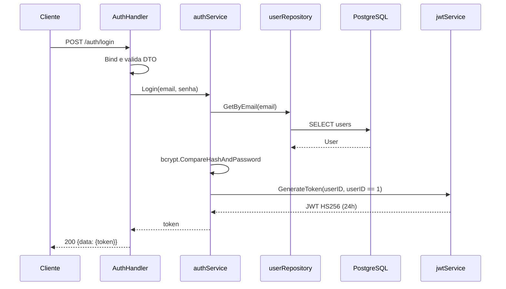
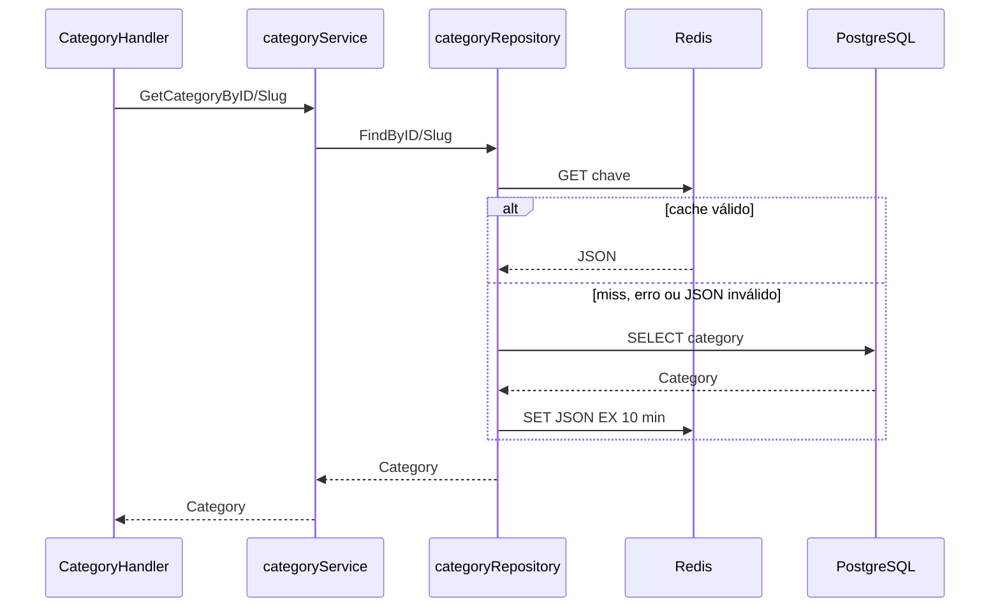
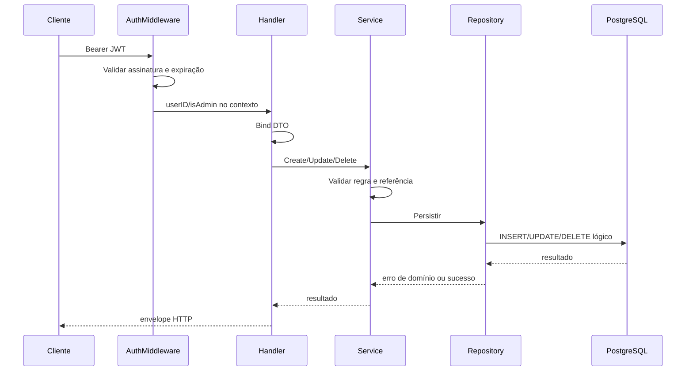

# Engenharia reversa do código atual

Data da análise: 2026-09-10

Commit-base analisado: `2720909`

Escopo: código Go escrito manualmente, composição da API, migrations, cache, autenticação, observabilidade e contratos HTTP existentes.

## 1. Objetivo e forma de leitura

Este documento explica o sistema a partir do código que existe hoje. Em Go não há `class` como em Java ou C#: o papel de uma classe é normalmente dividido entre:

- `struct`, que mantém estado e dependências;
- interface, que define o comportamento esperado;
- métodos com receiver, que implementam esse comportamento;
- funções construtoras `New...`, que montam uma implementação.

Por isso, o inventário abaixo trata structs, interfaces e seus métodos como uma única unidade conceitual. Código gerado (`docs/docs.go` e mocks GoMock), tipos de bibliotecas externas e funções auxiliares do seed não são detalhados campo a campo; eles aparecem no contexto em que afetam a aplicação.

Este é um retrato do comportamento observado, não uma descrição da arquitetura desejada. Funcionalidade presente apenas em migration ou seed é identificada como modelagem, não como funcionalidade executável.

## 2. Visão executiva

O projeto é uma API Go única, organizada como monólito modular parcial. Ela possui dois módulos de negócio executáveis:

- `identity`: autentica um usuário existente por e-mail e senha e emite JWT;
- `catalog`: lista e mantém categorias e produtos e lista SKUs.

PostgreSQL é a persistência principal. Redis é usado somente como cache de leitura de categorias, mas atualmente é obrigatório para o processo iniciar. Gin implementa HTTP; GORM acessa o banco; Zap registra logs estruturados.

As migrations também criam endereços, estoque, carrinhos, wishlists, pedidos e entregas. Esses conceitos ainda não possuem tipos de domínio, serviços, repositórios ou endpoints na aplicação.



## 3. Inicialização e ciclo de vida

O executável principal está em [`cmd/api/main.go`](../../cmd/api/main.go).

### Fluxo de inicialização

1. `config.Load()` lê `.env.local`, `.env` e variáveis do processo.
2. `logger.Init()` cria o logger global.
3. `setGinMode()` escolhe modo release somente quando `APP_ENVIRONMENT=production`.
4. `buildServer()` conecta PostgreSQL e Redis, cria o router, registra middlewares, monta os módulos e cria `http.Server`.
5. `runServer()` inicia `ListenAndServe` em uma goroutine.
6. `waitForShutdown()` aguarda `SIGINT` ou `SIGTERM`, aplica o timeout configurado e fecha HTTP, banco e Redis.

Se PostgreSQL ou Redis não estiver disponível no startup, a API não fica pronta. PostgreSQL tem tentativas de reconexão; Redis faz um único `PING` com timeout de cinco segundos.

### Composição de dependências

`setupIdentityModule()` monta manualmente:

```text
GORM -> userRepository -> authService <- jwtService -> AuthHandler
```

`setupCatalogModule()` monta manualmente:

```text
GORM + Redis -> categoryRepository -> categoryService -> CategoryHandler
GORM -> productRepository ---------> productService  -> ProductHandler
                  categoryRepository --^
GORM -> ProductSkuRepository -> ProductSkuService -> ProductSkuHandler
```

[`internal/catalog/wire.go`](../../internal/catalog/wire.go) contém uma tentativa anterior de injeção com Google Wire, mas não é usada pelo `main` e sua assinatura de categoria não fornece Redis. A composição executada em runtime é a montagem manual acima.

## 4. Tipos de configuração

Os tipos ficam em [`internal/shared/config/config.go`](../../internal/shared/config/config.go).

### `Config`

É o objeto raiz de configuração. Agrupa identidade da aplicação e quatro structs especializadas:

| Campo | Responsabilidade |
| --- | --- |
| `AppName` | Nome incluído nos logs; padrão `e-commerce-go` |
| `Version` | Versão exposta em logs e health checks; padrão `1.0.0` |
| `Environment` | Controla logger, modo Gin e exposição padrão de pprof; padrão `development` |
| `Server` | Timeouts e porta HTTP |
| `Database` | Conexão, pool e log do GORM |
| `Redis` | Endereço, senha e database lógico |
| `CORS` | Origens, métodos, headers, credenciais e cache de preflight |

### `ServerConfig`

Mantém `Port`, `ReadTimeout`, `WriteTimeout`, `IdleTimeout` e `ShutdownTimeout`. Os padrões são, respectivamente, `8081`, 15 s, 15 s, 60 s e 5 s. O objeto é consumido na criação e no encerramento do `http.Server`.

### `DatabaseConfig`

Mantém host, porta, usuário, senha, nome, SSL, tamanho do pool, vida máxima de conexão e nível de log. [`ConnectDB`](../../internal/shared/database/database.go) recarrega a configuração em vez de receber esta struct, e `configurePool` a carrega uma terceira vez.

### `RedisConfig`

Mantém `Host`, `Port`, `Password` e `DB`. É consumido por `NewRedisClient`.

### `CORSConfig`

É convertido diretamente em `cors.Config`. O padrão aceita todas as origens, os métodos HTTP comuns, headers básicos e não permite credenciais.

## 5. Domínio de catálogo

### `Category`

Definida em [`internal/catalog/domain/category.go`](../../internal/catalog/domain/category.go), representa uma linha da tabela `categories` e também o JSON devolvido pela API.

| Campo | Significado e comportamento |
| --- | --- |
| `ID` | Chave primária autoincremental |
| `Name` | Nome obrigatório; espaços externos são removidos |
| `Slug` | Identificador textual obrigatório e único no banco |
| `ParentID` | Referência opcional a outra categoria |
| `IsActive` | Estado de publicação/uso |
| `Description` | Descrição obrigatória pela validação Go |
| `CreatedAt`, `UpdatedAt` | Auditoria temporal preenchida por banco/GORM |
| `DeletedAt` | Controle de soft delete reconhecido pelo GORM |
| `DeletedReason` | Motivo preenchido pelo trigger de soft delete quando aplicável |

Métodos:

- `TableName()` fixa a tabela `categories`.
- `Validate()` normaliza nome, slug e descrição e exige que os três sejam não vazios.
- `UpdateState(newData)` copia somente strings não vazias, copia `ParentID` quando presente e sempre copia `IsActive`.

O último comportamento é importante: como `bool` tem valor zero `false`, uma atualização que omite `is_active` no HTTP cria uma struct com `false`, e `UpdateState` desativa a categoria mesmo sem solicitação explícita.

### `CategoryRepository`

É a porta de persistência consumida pelo serviço. Define:

- listagem paginada com filtros;
- busca por ID ou slug;
- criação, atualização e exclusão.

A interface mantém o serviço independente da implementação concreta, embora o próprio tipo `Category` ainda dependa de GORM por tags e `gorm.DeletedAt`.

### `CategoryService`

É o contrato usado pelo handler HTTP. Expõe os mesmos casos de uso do repositório com nomes de negócio e recebe `Pagination` nas listagens. A implementação acrescenta validação, verificação de existência e regras de categoria pai.

### `categoryService`

Definida em [`internal/catalog/service/category_service.go`](../../internal/catalog/service/category_service.go), guarda uma única dependência `CategoryRepository`.

| Método | O que faz |
| --- | --- |
| `ListCategories` | Converte `Pagination` em `limit/offset` e delega ao repositório |
| `GetCategoryByID` | Valida ID positivo e garante retorno não nulo |
| `GetCategoryBySlug` | Rejeita slug vazio, busca no repositório e garante existência |
| `CreateCategory` | Valida campos, verifica pai quando informado e persiste |
| `UpdateCategory` | Carrega estado atual, mescla alterações, valida, impede autorreferência direta e persiste |
| `DeleteCategory` | Confirma existência e solicita exclusão |
| `findCategoryOrFail` | Centraliza validação de ID e erro de não encontrado |
| `ensureParentExists` | Confirma que a categoria pai existe |

O serviço impede `ParentID == ID`, mas não detecta ciclos indiretos, como A ser filha de B enquanto B já é filha de A. Em `GetCategoryBySlug`, slug vazio retorna `ErrCategoryDescriptionRequired`, embora o erro semanticamente correto fosse o de slug.

### `categoryRepository`

Definido em [`internal/catalog/repository/category_repository.go`](../../internal/catalog/repository/category_repository.go), mantém `*gorm.DB` e `*cache.RedisClient`.

Comportamento por operação:

- `List`: compõe query GORM, conta o total, ordena por `id DESC` e pagina;
- `FindByID`: tenta `category:id:<id>` no Redis, consulta PostgreSQL no miss e armazena JSON por dez minutos;
- `FindBySlug`: repete cache-aside com `category:slug:<slug>`;
- `Create`: insere e converte violação única PostgreSQL em `ErrCategorySlugExists`;
- `Update`: usa `Save` e remove cache pelo ID e pelo slug atual;
- `Delete`: usa soft delete do GORM e remove apenas o cache por ID.

Falha de cache é ignorada nas leituras, escritas e invalidações, permitindo continuar pelo banco. Porém o cliente Redis precisa existir e estar conectado no startup. Ao alterar um slug, a chave do slug anterior não é removida. Ao excluir, a chave por slug também permanece até o TTL vencer.

## 6. Domínio de produto

### `Product`

Definido em [`internal/catalog/domain/product.go`](../../internal/catalog/domain/product.go), representa uma linha de `products` e o JSON de resposta.

| Campo | Significado e comportamento |
| --- | --- |
| `ID` | Chave primária |
| `Name`, `Slug`, `Description` | Identidade e conteúdo obrigatórios no domínio |
| `SeoTitle`, `SeoDescription` | Metadados SEO obrigatórios no domínio |
| `CategoryID` | Categoria obrigatória e positiva no domínio, embora a coluna aceite `NULL` |
| `IsActive` | Estado de publicação/uso |
| `CreatedAt`, `UpdatedAt` | Auditoria temporal |
| `DeletedAt`, `DeletedReason` | Soft delete e motivo |

Métodos:

- `TableName()` fixa a tabela `products`.
- `Validate()` remove espaços externos, exige os cinco campos textuais e uma categoria positiva.
- `UpdateState(newData)` aplica strings não vazias, uma categoria positiva e sempre copia `IsActive`.

Assim como em categoria, uma atualização parcial que omita `is_active` pode desativar o produto. Também não é possível limpar intencionalmente uma string por meio desse método, porque string vazia significa “não atualizar”.

### `ProductRepository`

Porta de persistência para listar, buscar por ID/slug, criar, atualizar e excluir produtos.

### `ProductService`

Contrato dos casos de uso consumido pelo `ProductHandler`.

### `productService`

Definido em [`internal/catalog/service/product_service.go`](../../internal/catalog/service/product_service.go), depende de `ProductRepository` e `CategoryRepository`.

| Método | O que faz |
| --- | --- |
| `ListProducts` | Delega paginação e filtros |
| `GetProductByID` | Valida ID e garante existência |
| `GetProductBySlug` | Exige slug e garante existência |
| `CreateProduct` | Valida o produto, verifica categoria e cria |
| `UpdateProduct` | Carrega, mescla, revalida, verifica nova categoria e salva |
| `DeleteProduct` | Confirma existência e exclui |
| `findProductOrFail` | Centraliza ID inválido/não encontrado |
| `ensureCategoryExists` | Usa o repositório de categorias para validar a referência |

Como a validação de categoria passa pelo repositório com cache, a criação ou alteração de produto também depende indiretamente do estado do cache de categoria.

### `productRepository`

Definido em [`internal/catalog/repository/product_repository.go`](../../internal/catalog/repository/product_repository.go), usa apenas GORM/PostgreSQL.

- Na análise de 2026-09-10, `List` tinha os predicados de `category_id` e `is_active`, mas não recebia as chaves produzidas pelo handler. Após ECOM-002.2, os filtros tipados são aplicados antes da contagem e da paginação.
- `FindByID` e `FindBySlug` convertem `gorm.ErrRecordNotFound` em `ErrProductNotFound`.
- `Create` e `Update` convertem violação única em `ErrProductSlugExists`.
- `Delete` faz soft delete e valida `RowsAffected`.

Não existe cache de produto.

## 7. Domínio de SKU

### `Product_skus`

Definido em [`internal/catalog/domain/sku.go`](../../internal/catalog/domain/sku.go), é o modelo de variante comercial do produto. O nome não segue a convenção Go; o nome idiomático seria `ProductSKU`.

| Campo | Significado |
| --- | --- |
| `ID` | Chave primária |
| `ProductID` | Produto proprietário |
| `SkuCode` | Código único da variante |
| `BarCode` | Código de barras opcional |
| `PriceCents` | Preço inteiro em centavos e positivo |
| `Stock` | Estoque declarado no tipo Go |
| `Attributes` | Atributos variáveis em JSONB |
| `IsActive` | Estado da variante |
| timestamps e exclusão | Auditoria e soft delete |

Há uma divergência material: a migration de `product_skus` não possui coluna `stock`; estoque fica na tabela separada `stock`. O modelo Go pode, portanto, solicitar uma coluna inexistente durante consultas. O código também não declara `TableName()`: o nome inferido pelo GORM deve ser confirmado em teste de integração.

### `ProductSkusRepository` e `ProductSkuService`

Ambas as interfaces expõem somente listagem paginada. Não existem operações de criação, leitura individual, atualização ou exclusão de SKU.

### `ProductSkuService`

É uma struct exportada em [`internal/catalog/service/sku_service.go`](../../internal/catalog/service/sku_service.go). Mantém o repositório e apenas repassa `limit`, `offset` e filtros.

### `ProductSkuRepository`

É uma struct exportada em [`internal/catalog/repository/sku_repository.go`](../../internal/catalog/repository/sku_repository.go). Monta uma query GORM, tenta filtrar, conta, ordena por ID descendente e pagina.

O filtro `sku_id` é aplicado a uma coluna `sku_id`, que não existe em `product_skus`; o identificador da tabela é `id`. No caminho HTTP atual, a incompatibilidade de chaves descrita na seção de handlers faz o filtro ser ignorado antes de gerar esse SQL.

## 8. Paginação e erros do catálogo

### `domain.Pagination`

Definida em [`internal/catalog/domain/pagination.go`](../../internal/catalog/domain/pagination.go), mantém `Page`, `Limit` e `Offset`.

`NewPagination(page, limit)` aplica:

- página 1 quando `page <= 0`;
- limite 10 quando `limit <= 0` ou `limit > 100`;
- offset `(page - 1) * limit` após normalização.

### Erros sentinela

[`internal/catalog/domain/errors.go`](../../internal/catalog/domain/errors.go) centraliza erros comparáveis por `errors.Is`. Eles cobrem IDs inválidos, registro ausente, campo obrigatório, slug duplicado e referência de categoria inválida.

Nem todos são usados ou mapeados corretamente:

- `ErrInvalidProductPrice` tem mensagem relacionada a descrição e não é usado;
- `ErrParentCategoryRequired` não é usado;
- erros de descrição e SEO de produto não entram no mapper HTTP e podem virar 500;
- slug vazio de categoria retorna o erro de descrição.

## 9. Domínio de identidade e autenticação

### `User`

Definido em [`internal/identity/domain/user.go`](../../internal/identity/domain/user.go), espelha parte da tabela `users`.

| Campo | Significado |
| --- | --- |
| `ID` | Identificador interno |
| `Email` | Login único no banco |
| `PasswordHash` | Hash bcrypt, omitido do JSON |
| `FullName`, `Phone` | Dados básicos de perfil |
| `CreatedAt`, `UpdatedAt` | Auditoria temporal |

O tipo não inclui os campos de soft delete presentes na migration. O GORM ainda consulta usuários normalmente, sem o filtro automático de `gorm.DeletedAt`; portanto a política para login de usuário excluído precisa ser confirmada por teste e corrigida explicitamente.

### `UserRepository`

Define apenas `GetByEmail(email)`. Diferente dos repositórios do catálogo, não recebe `context.Context`.

### `userRepository`

Definido em [`internal/identity/repository/user_repository.go`](../../internal/identity/repository/user_repository.go), usa GORM para buscar o primeiro usuário por e-mail. Converte ausência em um `errors.New("user not found")` criado no local, sem erro sentinela do domínio.

### `AuthService` e `authService`

`AuthService` expõe somente `Login(email, password)`. Sua implementação em [`internal/identity/service/auth_service.go`](../../internal/identity/service/auth_service.go):

1. busca o usuário pelo e-mail;
2. devolve `invalid credentials` para qualquer falha de busca;
3. compara senha e hash com bcrypt;
4. considera administrador exclusivamente o usuário com `ID == 1`;
5. emite o JWT e o devolve.

Não há cadastro, logout, refresh token, recuperação de senha, bloqueio por tentativas ou papel persistido no banco.

### `JWTService`, `jwtService` e `jwtCustomClaim`

Definidos em [`internal/shared/service/jwt_service.go`](../../internal/shared/service/jwt_service.go):

- `JWTService` define emissão e validação;
- `jwtService` mantém `secretKey` e `issuer`;
- `jwtCustomClaim` leva `user_id`, `is_admin` e claims registrados.

O token usa HS256, issuer `ecommerce-api` e validade de 24 horas. `ValidateToken` rejeita algoritmos fora da família HMAC, valida assinatura e claims padrão processados pela biblioteca.

O construtor recebe `*Config`, mas o ignora e usa uma chave fixa no código. Essa é a maior vulnerabilidade atual: qualquer pessoa que conheça o fonte pode assinar tokens aceitos pela API.

### Segurança de senha

[`internal/shared/security/password.go`](../../internal/shared/security/password.go) oferece:

- `HashPassword`, com bcrypt cost 14;
- `CheckPasswordHash`, que compara senha e hash e oculta o detalhe da falha.

Na API executável, apenas a comparação é usada. A geração de hash é utilizada pelo seed.

## 10. Camada HTTP

### `AuthHandler`, `LoginRequest` e `LoginResponse`

[`internal/identity/delivery/http/auth_handler.go`](../../internal/identity/delivery/http/auth_handler.go) injeta `AuthService` em `AuthHandler`.

- `LoginRequest` exige e-mail válido e senha;
- `LoginResponse` contém o token;
- `RegisterRoutes` registra `POST /api/v1/auth/login`;
- `Login` faz bind/validação, chama o serviço e traduz qualquer falha de login para 401.

Sucesso usa o envelope compartilhado, resultando em `{"data":{"token":"..."}}`, embora a anotação Swagger declare diretamente `LoginResponse`.

### `CategoryHandler` e seus DTOs

[`internal/catalog/delivery/http/category_handler.go`](../../internal/catalog/delivery/http/category_handler.go) mantém `CategoryService`.

- `CreateCategoryRequest` recebe nome, slug, pai, estado e descrição;
- `UpdateCategoryRequest` usa ponteiros para identificar campos presentes;
- `RegisterCategoryRoutes` deixa GETs públicos e protege POST/PUT/DELETE com JWT;
- os seis métodos HTTP fazem parsing, chamam o serviço, registram logs e padronizam respostas.

O DTO de update preserva a presença de `is_active`, mas essa informação se perde ao convertê-lo para `domain.Category`, cujo campo volta a ser `bool`. Também não há forma de remover um pai existente, pois `null` e campo omitido chegam como `nil`, interpretado como “não alterar”.

#### ECOM-002.1 update — September 11, 2026

Category listing now uses `CategoryListFilters` across the HTTP, service, and repository layers. The public `parent_id` and `is_active` filters are parsed into presence-preserving pointers, work separately or together, and apply to both the result query and its total. An explicit `is_active=false` remains distinguishable from an omitted filter. Malformed supported filter values return `400 invalid_request` before the service is called. Requests without filters retain the existing pagination behavior.

The undocumented repository-only `name` filter had no consumer and was removed. Repeated filter parameters retain Gin's existing first-value behavior; defining a different repeated-parameter policy remains a future contract decision. Focused handler tests and PostgreSQL repository tests provide the executable evidence for this update.

#### ECOM-002.3 update — September 12, 2026

Category updates now carry a `CategoryChanges` value from HTTP to the service and domain. Omitted fields leave the stored category unchanged. An explicit `is_active: false` deactivates it, while `parent_id: null` clears its parent; a positive parent ID assigns one. The handler rejects malformed or nonpositive parent IDs before calling the service. The service merges, validates, checks an assigned parent, then writes. Domain, service, and HTTP tests cover the update matrix. The original baseline observations above remain historical; indirect cycle prevention, complete cache invalidation, and post-write read errors remain separate units.

### `ProductHandler` e seus DTOs

#### ECOM-002.2 update — September 12, 2026

Product listing now passes `ProductListFilters` through HTTP, service, and repository. The documented `category_id` and `is_active` filters apply to rows and total, separately or together, including `is_active=false`. A present invalid filter returns `400 invalid_request` without calling the service. Omitted filters retain pagination behavior, and repeated filter parameters use Gin's first value. Handler regression tests and focused PostgreSQL repository tests cover this behavior.

#### ECOM-002.4 update — September 21, 2026

Product updates now carry `ProductChanges` from HTTP to service and domain. Omitted fields preserve stored values, while explicit `is_active: false` deactivates the product. Present text fields are trimmed and validated after merging. A present category ID must be positive and resolve to an existing category before the product is written. `category_id: null` does not clear the required relationship. Domain, service, and HTTP tests cover field presence, invalid input, errors, and authorization. The baseline `UpdateState` and handler observations above remain historical; inactive product creation and post-write read failure handling remain separate work.

[`internal/catalog/delivery/http/product_handler.go`](../../internal/catalog/delivery/http/product_handler.go) repete o padrão de categoria com `ProductService`.

- `CreateProductRequest` exige categoria, conteúdo, SEO e `is_active`;
- `UpdateProductRequest` usa ponteiros para alterações opcionais;
- GETs são públicos; mutações exigem qualquer JWT válido;
- após update, o handler relê o produto, mas ignora um possível erro dessa leitura.

`binding:"required"` em um `bool` exige valor verdadeiro no validator utilizado. Assim, o contrato de criação não representa corretamente um produto inicialmente inativo.

### `ProductSkuHandler`

[`internal/catalog/delivery/http/sku_handler.go`](../../internal/catalog/delivery/http/sku_handler.go) injeta `ProductSkuService`, registra somente `GET /api/v1/skus` e lista com paginação. Recebe `auth`, mas não o usa. A rota é pública e não possui anotações Swaggo.

### Problema dos filtros na análise de 2026-09-10

No commit-base analisado, os handlers inseriam chaves como `"category_id = ?"`, `"parent_id = ?"` e `"is_active = ?"`. Os repositórios procuravam `"category_id"`, `"parent_id"` e `"is_active"`; por isso, os filtros HTTP válidos eram silenciosamente ignorados. ECOM-002.1 corrigiu a listagem de categorias e ECOM-002.2 corrigiu a listagem de produtos. A divergência de `sku_id` permanece na listagem de SKUs.

Na análise original, parâmetros de filtro inválidos também eram ignorados, em vez de produzir 400. Os filtros suportados de categorias e produtos agora retornam `400 invalid_request` quando inválidos; essa correção ainda não abrange SKUs. Página e limite inválidos continuam normalizados por `NewPagination`.

## 11. Middlewares e transporte compartilhado

### `AuthMiddleware`

[`internal/shared/middleware/auth_middleware.go`](../../internal/shared/middleware/auth_middleware.go) mantém um `JWTService`. `Handle()`:

1. exige o header `Authorization`;
2. exige exatamente `Bearer <token>`;
3. valida o token;
4. copia `user_id` e `is_admin` para o contexto Gin;
5. continua a cadeia.

Nenhum handler consulta `isAdmin`. Logo, um usuário comum autenticado pode executar todas as mutações protegidas de catálogo.

### Validação e `ErrorHandler`

[`internal/shared/middleware/validation.go`](../../internal/shared/middleware/validation.go) contém:

- `RegisterCustomValidations()`, que registra formato de slug;
- `ErrorHandler()`, que examina erros anexados ao contexto após os handlers;
- `fieldErrorToMessage()`, que traduz tags de validação.

O bootstrap não chama `RegisterCustomValidations`, e os DTOs não usam `binding:"slug"`. Além disso, os handlers respondem diretamente aos erros de `ShouldBindJSON`, sem anexá-los ao contexto; por isso, o caminho especializado do `ErrorHandler` normalmente não participa dessas respostas.

### Respostas

[`internal/shared/response/response.go`](../../internal/shared/response/response.go) define:

- `ErrorResponse`: `{code, message}`;
- `PaginatedResponse`: `{data, pagination}`;
- `response.Pagination`: total, página, limite, páginas, indicador e links;
- helpers para sucesso, erro, aborto e paginação.

Respostas de sucesso não paginadas sempre usam `{"data": ...}`. Os links next/previous preservam apenas página e limite; filtros da requisição não são carregados para os links.

### Mapeamento de erro

[`internal/shared/transport/error_mapper.go`](../../internal/shared/transport/error_mapper.go) transforma erros conhecidos em:

- 404/`not_found`;
- 409/`conflict`;
- 400/`invalid_request`;
- 500/`internal_error` para os demais.

`HTTPErrorMapping` contém código HTTP, código público e nível de log. `LogByErrorMapping` usa esse nível para registrar o erro com Zap. Apesar de estar em `shared`, o mapper importa diretamente erros do catálogo, criando dependência do compartilhado para um módulo específico.

### Logging HTTP e recovery

[`pkg/logger/http_middleware.go`](../../pkg/logger/http_middleware.go) define:

- `GinLoggerMiddleware`, que registra status, método, caminho, query, IP, user-agent, latência e request ID;
- `RecoveryWithLogger`, que captura panic, registra stack e devolve 500 padronizado.

O logger base é global e inicializado uma vez por `sync.Once`. Em desenvolvimento usa console colorido; em produção usa configuração JSON do Zap. Todos os registros recebem serviço, ambiente, versão e PID.

`logger.WithContext` e `logger.FromContext` permitem logger em `context.Context`, mas o middleware atual não os usa; os handlers chamam o logger global diretamente.

## 12. Banco e cache

### `RedisClient`

[`internal/shared/cache/redis.go`](../../internal/shared/cache/redis.go) é um wrapper com o campo exportado `Client *redis.Client`. O construtor configura timeouts, executa `PING` e falha se Redis estiver indisponível. `Close()` encerra a conexão.

Embora o comentário diga que o cliente direto não é exposto, o campo exportado permite que o repositório o acesse diretamente. Não há uma interface de cache nem métodos próprios de get/set/delete.

### Conexão PostgreSQL

[`internal/shared/database/database.go`](../../internal/shared/database/database.go) cria DSN, mascara a senha nos logs, configura GORM e testa a conexão. A configuração GORM:

- desliga transação padrão para cada escrita;
- habilita prepared statements;
- seleciona o nível de log configurado.

A conexão tenta até 30 vezes, com espera linear de `2s * número da tentativa`, apesar do comentário mencionar backoff exponencial. O `time.Sleep` não observa o cancelamento durante a espera.

### Modelo físico

As três migrations criam 15 tabelas:

| Grupo | Tabelas | Cobertura no código Go executável |
| --- | --- | --- |
| Identidade | `users`, `addresses` | Leitura de usuário no login; endereço sem camada de aplicação |
| Catálogo | `categories`, `products`, `product_skus`, `price_history` | CRUD de categoria/produto; somente listagem de SKU; histórico sem camada |
| Estoque | `stock`, `stock_movements` | Sem tipos, serviço ou API |
| Compra | `carts`, `cart_items`, `wishlists`, `wishlist_items` | Sem tipos, serviço ou API |
| Pedido | `orders`, `order_items`, `shipments` | Sem tipos, serviço ou API |

Triggers atualizam `updated_at`. Alguns triggers interceptam `DELETE` e convertem em atualização de `deleted_at/deleted_reason`. GORM também reconhece soft delete apenas nos modelos que contêm `gorm.DeletedAt`.

Não há executor de migrations dentro da API. O ambiente precisa aplicá-las externamente. O executável [`cmd/seed/main.go`](../../cmd/seed/main.go) limpa tabelas com `TRUNCATE ... CASCADE` e cria dados de demonstração para todas as áreas modeladas; ele não representa casos de uso da aplicação.

## 13. Rotas e comportamento externo

| Método | Rota | Autenticação | Unidade principal |
| --- | --- | --- | --- |
| POST | `/api/v1/auth/login` | Pública | `AuthHandler.Login` |
| GET | `/api/v1/categories` | Pública | `CategoryHandler.ListCategories` |
| GET | `/api/v1/categories/:id` | Pública | `CategoryHandler.GetCategory` |
| GET | `/api/v1/categories/slug/:slug` | Pública | `CategoryHandler.GetCategoryBySlug` |
| POST | `/api/v1/categories` | JWT | `CategoryHandler.CreateCategory` |
| PUT | `/api/v1/categories/:id` | JWT | `CategoryHandler.UpdateCategory` |
| DELETE | `/api/v1/categories/:id` | JWT | `CategoryHandler.DeleteCategory` |
| GET | `/api/v1/products` | Pública | `ProductHandler.ListProducts` |
| GET | `/api/v1/products/:id` | Pública | `ProductHandler.GetProduct` |
| GET | `/api/v1/products/slug/:slug` | Pública | `ProductHandler.GetProductBySlug` |
| POST | `/api/v1/products` | JWT | `ProductHandler.CreateProduct` |
| PUT | `/api/v1/products/:id` | JWT | `ProductHandler.UpdateProduct` |
| DELETE | `/api/v1/products/:id` | JWT | `ProductHandler.DeleteProduct` |
| GET | `/api/v1/skus` | Pública | `ProductSkuHandler.ListSkus` |

Rotas operacionais:

| Rota | Função |
| --- | --- |
| `/live` | Confirma que o processo está vivo e informa versão |
| `/ready` | Faz ping no PostgreSQL com timeout de 2 s |
| `/metrics` | Métricas Gin/Prometheus |
| `/swagger/*any` | Interface Swagger |
| `/docs` | Redoc carregado por CDN |
| `/debug/pprof/*` | Profiling fora de produção ou com `ENABLE_PPROF=true` |

O readiness não testa Redis, mesmo que ele seja obrigatório no startup e usado nas consultas de categoria.

## 14. Fluxos principais

### Login



### Leitura de categoria com cache



### Mutação de catálogo



O valor `isAdmin` é extraído, mas não existe decisão de autorização depois dessa etapa.

## 15. Dependências e direção real

```text
cmd/api
  -> delivery/http
  -> service
  -> repository
  -> shared

delivery/http -> interfaces e entidades de domain
service       -> interfaces e entidades de domain
repository    -> entidades de domain + GORM/Redis
domain        -> context + GORM (acoplamento de infraestrutura)
shared/transport -> erros de catalog/domain (dependência invertida indesejada)
```

A separação handler/serviço/repositório existe e facilita localizar responsabilidades. Entretanto, o domínio não é independente de framework e o pacote compartilhado conhece um módulo de negócio. O sistema se aproxima de uma arquitetura em camadas modular, não de Clean Architecture estrita.

## 16. Onde alterar cada comportamento

| Necessidade | Ponto de entrada |
| --- | --- |
| Adicionar/alterar campo de categoria | migration nova, `domain.Category`, DTOs HTTP e testes |
| Mudar regra de categoria | `categoryService` e/ou métodos de `Category` |
| Mudar consulta/cache de categoria | `categoryRepository` |
| Adicionar/alterar campo de produto | migration nova, `domain.Product`, DTOs e testes |
| Mudar regra de produto | `productService` e/ou métodos de `Product` |
| Mudar consulta de produto | `productRepository` |
| Completar SKU | alinhar migration/modelo e então expandir domínio, serviço, repositório e handler |
| Mudar autenticação | `AuthHandler`, `authService`, `userRepository` e `JWTService` |
| Adicionar autorização | policy/middleware e grupos protegidos de rota |
| Mudar formato global de resposta | `internal/shared/response` e OpenAPI |
| Mudar tradução de erro | `internal/shared/transport/error_mapper.go` |
| Mudar configuração | `internal/shared/config` e injeção no bootstrap |
| Criar carrinho/pedido/estoque | novo módulo/corte vertical; hoje só existe schema |

Alterações de banco devem ser migrations incrementais. Modificar migrations antigas pode quebrar ambientes que já as aplicaram.

## 17. Testes e confiança da análise

Os testes existentes não cobrem os comportamentos de negócio descritos:

- `product_handler_test.go` contém um teste vazio;
- `pkg/logger/example_test.go` exercita inicialização e chamadas do logger;
- mocks GoMock de produto foram gerados, mas não são consumidos por testes.

Assim, esta engenharia reversa combina leitura estática e compilação/testes gerais; ela não afirma que PostgreSQL, Redis, migrations e HTTP funcionam juntos em runtime. Comportamentos dependentes do GORM, triggers e schema — especialmente SKU e soft delete — exigem testes de integração.

## 18. Riscos prioritários observados

| Prioridade | Risco | Efeito atual |
| --- | --- | --- |
| Crítica | Chave JWT fixa no fonte | Permite falsificação de token por quem conhece a chave |
| Crítica | Sem autorização de administrador | Qualquer usuário autenticado altera o catálogo |
| Alta | `IsActive` perde informação de presença no update | Atualização parcial pode desativar registros |
| Alta | Chaves de filtro divergentes | Filtros HTTP são ignorados silenciosamente |
| Alta | Modelo SKU diverge do schema | Consulta pode falhar ou representar estoque incorretamente |
| Alta | Cache por slug não é totalmente invalidado | Pode devolver categoria antiga/excluída por até 10 minutos |
| Alta | Ausência de testes de negócio/integração | Regressões não são detectadas automaticamente |
| Média | Redis obrigatório, mas fora do readiness | Estado operacional fica incoerente |
| Média | OpenAPI diverge dos envelopes e omite SKU | Consumidores recebem um contrato incompleto |
| Média | Configuração carregada múltiplas vezes | Dificulta validação única e previsibilidade |

## 19. Resumo por unidade

| Unidade | Estado | Responsabilidade atual |
| --- | --- | --- |
| `Category` + interfaces | Parcial | Regras e contratos de categoria |
| `categoryService` | Parcial | Orquestra validação, pai e CRUD |
| `categoryRepository` | Parcial | PostgreSQL e cache Redis de categoria |
| `CategoryHandler` + DTOs | Parcial | Contrato HTTP de categoria |
| `Product` + interfaces | Parcial | Regras e contratos de produto |
| `productService` | Parcial | Orquestra validação, categoria e CRUD |
| `productRepository` | Parcial | Persistência PostgreSQL de produto |
| `ProductHandler` + DTOs | Parcial | Contrato HTTP de produto |
| `Product_skus` + interfaces | Inicial/inconsistente | Modelo e contrato somente de listagem |
| `ProductSkuService/Repository/Handler` | Inicial | Pipeline de listagem de SKU |
| `User` + interfaces | Parcial | Leitura mínima para autenticação |
| `authService` | Parcial | Verifica credenciais e solicita token |
| `jwtService` | Funcional, inseguro | Emite e valida JWT com chave fixa |
| `AuthMiddleware` | Parcial | Autentica; não autoriza por papel |
| `Config` e subtipos | Funcional | Carrega parâmetros com defaults |
| `RedisClient` | Funcional | Abre e fecha conexão Redis |
| response/transport/logger | Parcial | Envelope, erros e observabilidade HTTP |
| modelos de compra/pedido/estoque | Apenas SQL | Ainda não existem como unidades Go |

Este documento deve ser atualizado quando uma mudança alterar responsabilidades, dependências, rotas, regras ou o modelo persistido.
