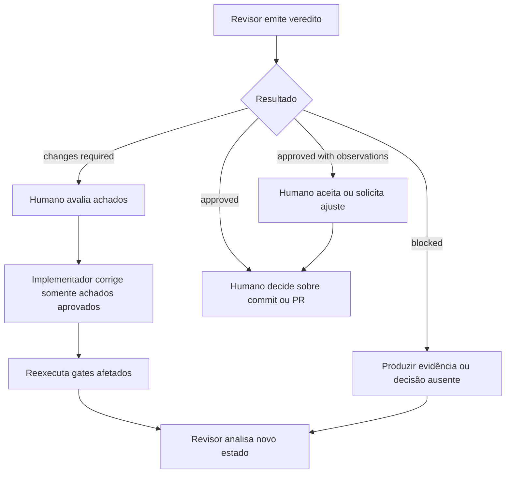

# Política de Revisão Independente de Unidades do Roadmap

Status: proposta para adoção

Aplicação: revisões pré-commit e revisões de pull request de unidades `ECOM-*.*`

## 1. Propósito

Esta política define como um segundo agente deve revisar uma unidade do roadmap
de forma independente, consistente, segura e auditável.

O objetivo da revisão não é apenas encontrar erros de sintaxe. O revisor deve
determinar se a mudança:

- entrega exatamente o comportamento aprovado;
- possui evidência executável suficiente;
- preserva contratos, dados e segurança;
- respeita a arquitetura e o escopo da unidade;
- documenta corretamente o comportamento atual;
- está pronta para a próxima autorização humana.

A revisão é uma barreira de qualidade, não uma autorização automática de commit,
push, merge ou deploy.

## 2. Princípios

### 2.1 Reconstruir em vez de confiar

O relatório do implementador pode orientar a navegação, mas não comprova a
correção. O revisor deve confirmar afirmações no código, nos testes, no diff, no
Git e nos resultados reais dos gates.

### 2.2 Revisar intenção, não somente implementação

O revisor deve compreender por que a unidade existe, qual comportamento é
observável e quem é afetado. Uma solução tecnicamente elegante pode estar errada
se resolver outro problema.

### 2.3 Evidência acima de confiança

Uma afirmação como “os testes passaram” deve ser acompanhada do comando e do
resultado. Um teste de integração pulado não equivale a um teste executado. Uma
referência local `origin/main` não comprova o estado atual do remoto.

### 2.4 Menor mudança completa

O diff deve conter tudo o que a unidade exige e nada que pertença a outra
unidade. Menor não significa incompleto; completo não significa aproveitar a
tarefa para limpar todo o repositório.

### 2.5 Independência operacional

O revisor começa em modo somente leitura e não corrige os próprios achados. O
humano decide quais achados são válidos e os devolve ao implementador.

### 2.6 Simplicidade e sinal

O revisor deve comunicar os problemas que mudam uma decisão. Não deve criar
observações artificiais para parecer rigoroso, narrar cada comando nem repetir o
diff inteiro no relatório.

## 3. Papéis

| Papel | Responsabilidade |
| --- | --- |
| Implementador | Produzir a mudança, testes, documentação e evidências |
| Revisor | Tentar invalidar a conclusão com análise independente |
| Humano responsável | Aprovar escopo, avaliar achados e autorizar ações |
| CI | Reexecutar gates reproduzíveis em ambiente controlado |

Dois agentes podem compartilhar pontos cegos. A decisão final permanece humana.

## 4. Modos de revisão

### 4.1 `pre-commit`

Usado quando a implementação está no worktree e ainda não foi commitada.

O revisor precisa considerar três áreas diferentes:

1. alterações rastreadas e não staged;
2. alterações staged;
3. arquivos não rastreados.

`git diff` não inclui arquivos não rastreados. Portanto, o revisor deve sempre
combinar o diff com `git status` e a lista de arquivos novos.

### 4.2 `pull-request`

Usado quando existe branch remota ou pull request.

O revisor deve confirmar:

- base correta;
- head correto;
- commits pertencentes à unidade;
- diff completo entre base e head;
- checks e CI associados ao mesmo commit revisado;
- ausência de atualização da branch após a revisão.

Se o head mudar, a aprovação anterior deixa de cobrir o novo estado.

## 5. Limites de autorização

Por padrão, a revisão permite somente leitura.

| Ação | Permitida por “revise” |
| --- | --- |
| Ler código, documentos e Git | Sim |
| Executar checks locais não mutáveis | Sim, quando seguros e aplicáveis |
| Alterar arquivos | Não |
| Executar formatador com escrita | Não |
| Fazer stage | Não |
| Criar commit | Não |
| Fazer push | Não |
| Comentar ou aprovar PR | Não |
| Atualizar Jira | Não |
| Criar/remover contêiner | Não, salvo autorização específica |
| Usar banco compartilhado | Não |
| Acessar ou alterar produção | Não |
| Fazer merge ou deploy | Não |

Se uma evidência exigir nova permissão, o revisor registra o bloqueio e solicita
decisão. Não contorna a restrição.

## 6. Fontes obrigatórias

Antes de emitir veredito, leia:

1. `AGENTS.md`.
2. A unidade selecionada em
   `docs/project/02-current-scope-quality-gap-analysis.md`.
3. A implementation note correspondente.
4. As seções relevantes de
   `docs/project/01-engenharia-reversa-codigo-atual.md`.
5. As seções relevantes de `docs/project/arquitetura-e-commerce-go.md`.
6. O código e os testes afetados.
7. O diff completo.
8. Os resultados reais dos gates.

Consulte `docs/project/03-complete-ecommerce-implementation-roadmap.md` somente
quando a unidade depender de uma fronteira futura ou houver risco de antecipar
funcionalidade planejada.

Leia seções relevantes em documentos grandes. Não carregue conteúdo sem relação
com a unidade.

## 7. Precedência da fonte de verdade

Quando houver conflito, siga a precedência definida no `AGENTS.md`. Em geral:

1. código executável e testes para comportamento atual;
2. ADRs aceitos para decisões arquiteturais;
3. gap analysis para prioridade e contrato de estabilização;
4. roadmap para comportamento futuro;
5. arquitetura-alvo para direção pretendida;
6. engenharia reversa para o último retrato documentado;
7. README e documentação gerada como resumos.

Não resolva conflito significativo silenciosamente. Registre o conflito e seu
impacto no veredito.

## 8. Preparação da revisão

### 8.1 Identificar o objeto exato

Registre:

- unidade;
- modo de revisão;
- branch;
- base;
- head ou estado do worktree;
- implementation note;
- data e ambiente da evidência;
- autorizações concedidas.

### 8.2 Verificar Git no modo `pre-commit`

Use comandos somente leitura equivalentes a:

```bash
git status --short --branch
git branch --show-current
git rev-parse HEAD
git rev-parse main
git rev-parse origin/main
git merge-base HEAD main
git log --oneline --decorate -n 10
git diff --stat
git diff --check
git diff --name-status
git diff --cached --name-status
git ls-files --others --exclude-standard
```

Para cada arquivo não rastreado:

```bash
git diff --no-index -- /dev/null caminho/do/arquivo || true
```

O código 1 de `git diff --no-index` indica que existem diferenças; não significa
falha da revisão.

Não use `git add -N` apenas para tornar arquivos visíveis ao diff, pois isso muda
o index.

### 8.3 Verificar Git no modo `pull-request`

Confirme a base e o head usando os dados do provedor Git. Depois examine os
commits e o diff correspondentes. Não presuma que a branch local representa o PR
remoto.

Registre o hash completo do head revisado. Checks executados contra outro hash
não comprovam o head atual.

## 9. Reconstrução do contrato

Extraia da unidade e da implementation note:

- objetivo;
- resultado observável;
- motivo;
- dependências;
- suposições;
- escopo incluído;
- escopo excluído;
- impacto público;
- impacto persistente;
- critérios de aceite;
- matriz de testes;
- gates;
- rollout e rollback;
- limitações aceitas.

Se esses elementos divergirem, determine qual versão foi aprovada. Se não houver
evidência da aprovação, use o veredito `blocked by missing evidence` quando a
divergência puder mudar a implementação.

## 10. Revisão de escopo

Confirme:

- exatamente uma unidade executável no diff;
- nenhum épico inteiro sendo implementado;
- nenhuma refatoração independente;
- nenhuma atualização ampla de dependências;
- nenhuma migration não prevista;
- nenhum arquivo local, backup ou artefato acidental;
- nenhuma correção de documentação geral escondida;
- nenhum comportamento futuro antecipado sem autorização;
- todos os arquivos necessários presentes.

Uma mudança fora do escopo pode ser correta tecnicamente e ainda assim bloquear a
unidade por aumentar risco e dificultar rollback.

## 11. Revisão por camada

### 11.1 Domínio e contratos internos

- Tipos representam presença, ausência, `false`, `zero` e `null` corretamente?
- Regras de negócio permanecem independentes de Gin, GORM, Redis e SDKs?
- Interfaces têm consumidores reais?
- A abstração reduz risco concreto ou é prematura?
- Invariantes estão explícitas em tipos, validação ou testes?

### 11.2 HTTP

- Parsing e validação estão na camada de entrega?
- Entrada ausente é distinguida de entrada vazia?
- Limites, overflow e representações aceitas estão definidos?
- Status, envelope e código de erro são estáveis?
- Erro interno não é exposto?
- Serviço deixa de ser chamado após erro de entrada?
- Autenticação e autorização continuam corretas?
- Anotações OpenAPI representam o comportamento?

### 11.3 Serviço

- Decisões de negócio estão na camada correta?
- Contexto é propagado nas fronteiras de I/O?
- Erros preservam classificação?
- Escritas múltiplas usam transação quando necessário?
- Falhas parciais foram consideradas?

### 11.4 Repositório

- Queries são parametrizadas?
- Filtros são aplicados consistentemente a dados e total?
- Paginação e ordenação são determinísticas?
- O contexto chega ao banco?
- Erros são retornados e classificados?
- Soft delete e visibilidade permanecem consistentes?
- O repositório acessa somente o banco do próprio serviço?

### 11.5 Cache e integrações

- Chaves e TTL seguem a política?
- Invalidação cobre todas as chaves afetadas?
- Falha do provedor possui comportamento definido?
- Retries são limitados e seguros?
- Operações repetíveis exigem idempotência?
- Dados sensíveis permanecem fora de logs e erros?

### 11.6 Concorrência

- Existe condição de corrida possível?
- A operação depende de check-then-act sem proteção?
- Locks, transações e constraints são suficientes?
- Testes concorrentes ou race detector são relevantes?

## 12. Revisão de testes

### 12.1 Pergunta central

O teste falharia se o defeito permanecesse?

Não basta verificar que uma função foi chamada. O teste precisa demonstrar o
resultado ou contrato importante.

### 12.2 Teste de regressão

Para bugs, procure evidência de que:

1. o teste foi criado antes da correção;
2. foi executado contra o comportamento defeituoso;
3. falhou pelo motivo esperado;
4. passou depois da menor correção completa.

Falha de compilação, fixture, ambiente ou conexão não comprova o bug.

### 12.3 Matriz mínima aplicável

Considere, quando relevantes:

- caminho de sucesso;
- entrada ausente;
- entrada vazia;
- `false`, zero e `null`;
- limites e overflow;
- valores malformados;
- combinação de opções;
- resultado vazio;
- paginação, total e ordenação;
- autenticação e autorização;
- conflito e duplicidade;
- transições de estado;
- falha de dependência;
- concorrência;
- idempotência;
- rollback ou compensação.

Não exija cenários irrelevantes apenas para aumentar a quantidade de testes.

### 12.4 Testes de integração

Confirme:

- tecnologia equivalente à produção quando a semântica importa;
- ambiente temporário e isolado;
- migrations aplicadas;
- fixtures sintéticas e determinísticas;
- nenhuma dependência em dados preexistentes;
- limpeza ou rollback seguro;
- ausência de segredos em saída;
- distinção entre executado e pulado.

Um teste condicionado por variável de ambiente pode ser válido, mas a suíte geral
não comprova sua execução quando ele foi pulado.

### 12.5 Qualidade do teste

- Nome descreve o comportamento?
- Arrange, Act e Assert são compreensíveis?
- O teste evita temporização frágil?
- A ordem dos dados é determinística?
- O mock preserva semântica e argumentos?
- O teste não replica a implementação?
- O teste não foi enfraquecido para passar?
- Não há `Skip`, exclusão ou remoção injustificada?

## 13. Contratos e compatibilidade

Verifique impacto em:

- OpenAPI;
- campos JSON;
- códigos e envelopes de erro;
- status HTTP;
- paginação;
- ordenação;
- eventos;
- schema de banco;
- cache;
- consumidores existentes;
- versões em execução simultânea.

Uma correção pode mudar comportamento antes defeituoso. Essa mudança deve estar
nos critérios, testes, documentação e risco de compatibilidade.

## 14. Persistência e migrations

Quando houver mudança de dados:

- migration é compatível com rollout?
- lock ou duração podem afetar produção?
- constraints refletem invariantes?
- dados existentes satisfazem a nova regra?
- backfill está definido?
- rollback é seguro ou existe estratégia roll-forward?
- aplicação antiga e nova coexistem durante deploy?
- teste de migration usa banco isolado?

Não aprove migration destrutiva com base apenas em teste de instalação limpa.

## 15. Segurança e privacidade

Procure:

- credenciais, tokens, cookies e URLs com segredos;
- dados pessoais em fixtures, logs ou documentação;
- query ou comando construído por concatenação insegura;
- autorização ausente ou baseada apenas em entrada do cliente;
- erro interno exposto;
- log de payload sensível;
- entrada sem limite;
- uso de algoritmo ou configuração insegura;
- dependência nova sem justificativa;
- permissão mais ampla que o necessário;
- acesso a armazenamento de outro serviço.

Redija qualquer segredo encontrado. Não o repita no relatório.

## 16. Código limpo e comentários

O revisor deve favorecer código que se explique por nomes, tipos e estrutura.

Comentários devem explicar motivo, restrição ou decisão não óbvia. Marque como
ruído comentários que apenas narram operações como “incrementa contador”,
“retorna resultado” ou “verifica erro”.

Verifique também:

- comentário que ficou falso;
- `TODO` sem tarefa rastreável quando a política exigir;
- abstração sem uso concreto;
- duplicação introduzida sem necessidade;
- função excessivamente ampla;
- nome que oculta semântica importante.

Não recomende remoção de documentação pública exigida pela linguagem ou pelo
projeto.

## 17. Documentação

Confirme:

- comportamento atual atualizado quando mudou;
- roadmap e implementation note no estado correto;
- planned, implemented e verified não foram confundidos;
- data, branch, commit e evidências corretos;
- OpenAPI e artefatos gerados atualizados quando possível;
- bloqueios de geração registrados honestamente;
- links locais preservados;
- nenhum documento reescrito fora do escopo;
- limitações conhecidas mantidas visíveis.

O estado `review` indica implementação pronta para revisão. `done` exige a
aprovação definida pelo processo do projeto.

## 18. Gates

Leia o `Makefile`, scripts e CI antes de escolher comandos.

Classifique cada gate:

| Estado | Significado |
| --- | --- |
| `pass` | executado com sucesso contra o estado revisado |
| `fail` | executado e falhou |
| `blocked` | não pôde executar por dependência ou permissão |
| `unavailable` | ferramenta ou gate não existe no ambiente |
| `not applicable` | não se aplica à unidade, com justificativa |
| `not executed` | aplicável, mas não foi executado |

Checks comuns:

- formatação;
- `go vet`;
- lint;
- testes focados;
- suíte completa;
- race detector;
- testes PostgreSQL e Redis;
- migrations;
- build;
- OpenAPI drift;
- secret scanning;
- vulnerability scanning;
- container build e scan.

### 18.1 Comandos somente leitura

O revisor pode executar checks que não alterem arquivos ou serviços, por exemplo:

```bash
gofmt -l <arquivos-go-alterados>
go vet ./...
go test ./pacote/afetado/... -count=1
go test ./... -count=1
go test -race ./...
go build ./...
git diff --check
```

Não execute `make fmt`, geradores ou ferramentas que reescrevam o worktree na
primeira revisão. Não inicie infraestrutura nem use banco compartilhado sem
autorização.

Após os checks, execute novamente `git status --short --branch` e confirme que a
revisão não modificou o worktree.

## 19. Achados

Apresente achados antes do resumo, ordenados por severidade.

### 19.1 `blocking`

Use para problemas que impedem conclusão:

- comportamento incorreto;
- vulnerabilidade relevante;
- risco de perda ou corrupção de dados;
- quebra de contrato não aprovada;
- migration insegura;
- mudança importante fora do escopo;
- ausência de evidência indispensável.

### 19.2 `important`

Use para problema significativo que normalmente deve ser corrigido na unidade:

- teste frágil ou incapaz de provar critério relevante;
- erro de manutenção com consequência concreta;
- documentação materialmente inconsistente;
- tratamento de falha aplicável ausente.

### 19.3 `suggestion`

Use para melhoria opcional que pode ser adiada sem falsificar a conclusão.

Não transforme preferência estética em bloqueio.

### 19.4 Formato de cada achado

```text
[classificação] Título objetivo

Arquivo/trecho:
Evidência:
Consequência:
Menor correção recomendada:
```

## 20. Veredito

Retorne exatamente um:

### `approved`

Nenhum achado bloqueante ou importante e evidência suficiente.

### `approved with non-blocking observations`

Somente sugestões ou riscos residuais explicitamente aceitáveis.

### `changes required`

Existe achado bloqueante ou importante que deve retornar ao implementador.

### `blocked by missing evidence`

Não é possível concluir sem informação, diff, teste ou autorização ausente.

## 21. Formato do relatório

```markdown
# Revisão independente — ECOM-XXX.X

## Achados

1. [blocking|important|suggestion] Título
   - Arquivo/trecho:
   - Evidência:
   - Consequência:
   - Menor correção:

## Veredito

approved | approved with non-blocking observations | changes required |
blocked by missing evidence

## Critérios de aceite

| Critério | Estado | Evidência |
| --- | --- | --- |

## Testes e gates

| Verificação | Estado | Evidência ou limitação |
| --- | --- | --- |

## Escopo e arquivos

- Base/head ou estado do worktree:
- Arquivos revisados:
- Mudanças fora do escopo:

## Segurança, contratos e persistência

- Resultado:

## Riscos residuais

- ...

## Integridade da revisão

- Worktree permaneceu inalterado:
- Stage/commit/push/merge realizados: não
- Hash revisado, quando aplicável:

## Próxima ação recomendada

- ...
```

Se não houver achados, escreva “Nenhum achado” e continue com o veredito e as
evidências. Não invente problemas para preencher a seção.

## 22. Ciclo após a revisão



O revisor não envia automaticamente achados para sistemas externos. O humano
seleciona o que deve voltar ao implementador.

## 23. Condições de parada

Pare e informe o bloqueio quando:

- unidade ou objeto revisado for ambíguo;
- implementação mudar durante a revisão;
- implementation note aprovada estiver ausente;
- diff completo não estiver disponível;
- arquivo novo relevante não puder ser lido;
- evidência exigir acesso não autorizado;
- teste exigir banco compartilhado ou produção;
- houver conflito de requisito que altere a solução;
- segredo for encontrado;
- base ou head do PR não puder ser confirmado.

## 24. Antipadrões do revisor

- Repetir o relatório do implementador sem inspecionar o diff.
- Corrigir o código durante a primeira análise.
- Executar `git add` para facilitar a visualização.
- Exigir alterações fora do critério aprovado.
- Tratar gosto pessoal como falha.
- Aceitar quantidade de testes como qualidade.
- Considerar teste pulado como aprovado.
- Declarar remoto atualizado usando apenas referência local.
- Aprovar documentação que descreve comportamento futuro como atual.
- Publicar comentários excessivos no Jira ou PR.
- Revelar segredos encontrados.
- Aprovar o próprio merge.

## 25. Checklist final

### Contrato

- [ ] Unidade e versão aprovada identificadas.
- [ ] Objetivo e impacto compreendidos.
- [ ] Escopo incluído e excluído conferidos.
- [ ] Todos os critérios possuem evidência.

### Git e diff

- [ ] Branch, base e head confirmados.
- [ ] Diff rastreado revisado.
- [ ] Stage revisado.
- [ ] Arquivos não rastreados revisados.
- [ ] Nenhum arquivo acidental ou segredo.

### Código e testes

- [ ] Todos os consumidores das assinaturas foram localizados.
- [ ] Casos de limite relevantes cobertos.
- [ ] Regressão pré-correção comprovada.
- [ ] Integrações realmente executadas ou marcadas como bloqueadas.
- [ ] Nenhum teste válido foi enfraquecido.

### Segurança e operação

- [ ] Entrada, autorização e erros revisados.
- [ ] Dados, migrations e rollback revisados.
- [ ] Concorrência e idempotência consideradas quando aplicáveis.
- [ ] Observabilidade não expõe dados sensíveis.

### Documentação e gates

- [ ] Comportamento atual documentado.
- [ ] Execution status correto.
- [ ] Contratos e artefatos gerados consistentes ou bloqueio registrado.
- [ ] Gates classificados honestamente.

### Encerramento

- [ ] Achados possuem evidência e consequência.
- [ ] Veredito único emitido.
- [ ] Riscos residuais registrados.
- [ ] Worktree permaneceu inalterado.
- [ ] Nenhuma ação remota ou destrutiva foi executada.
