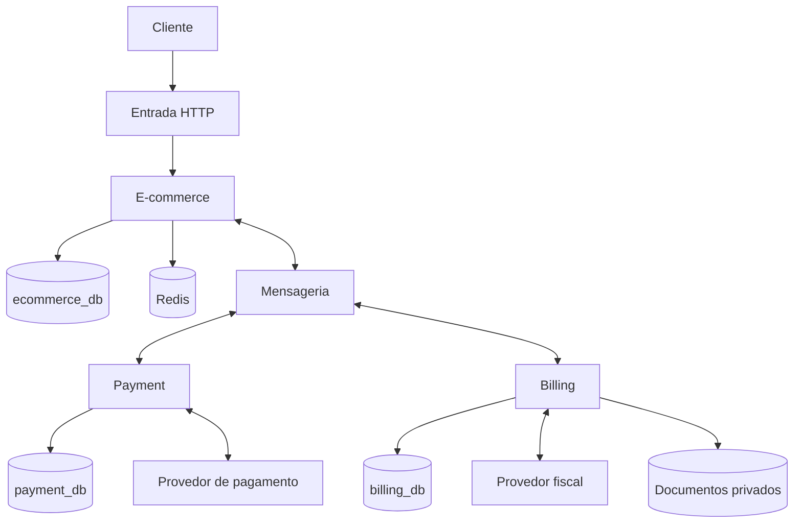
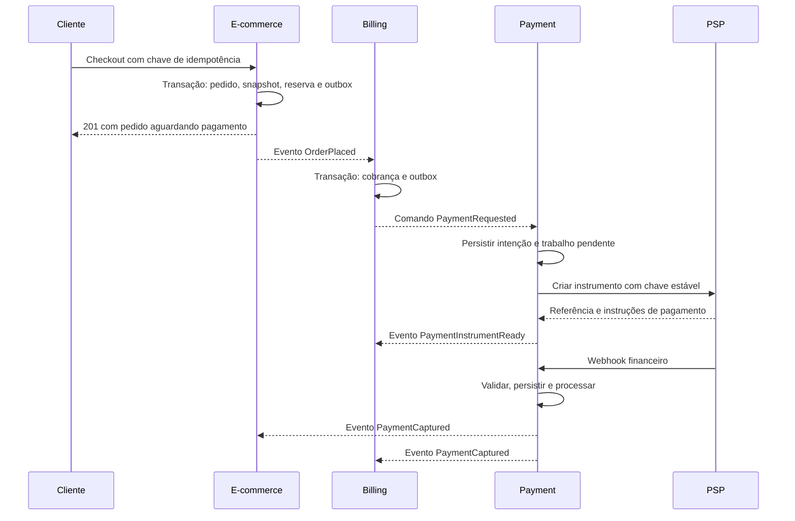
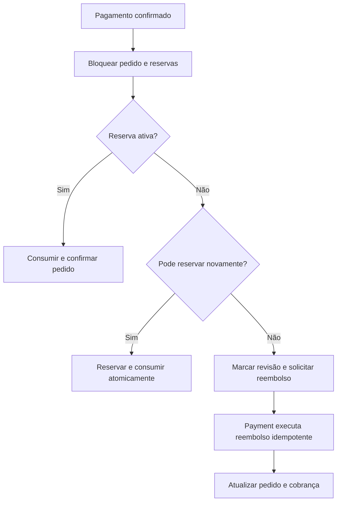
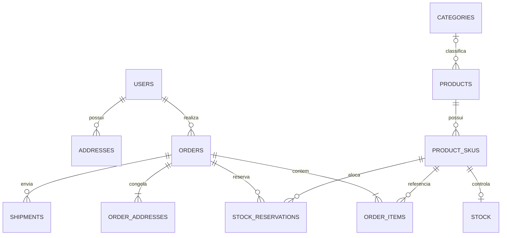
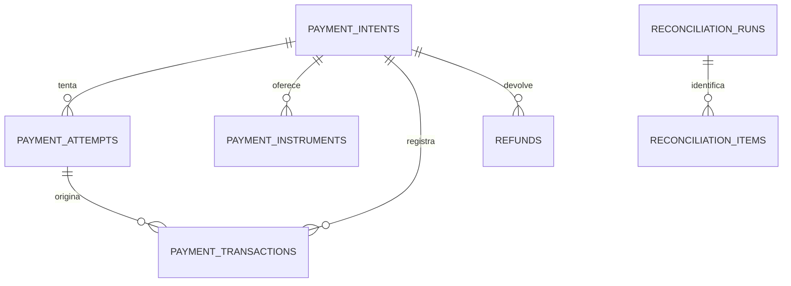
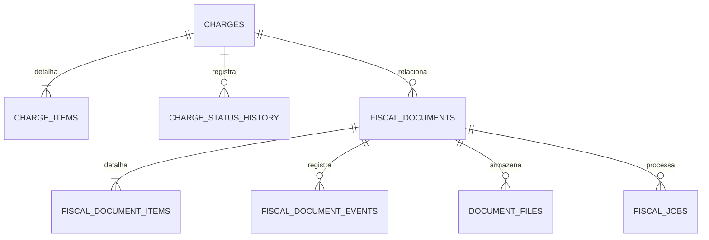

# E-commerce Go — documentação de arquitetura e execução

Versão 1.0 • 11 de setembro de 2026 • Status: proposta técnica para implementação incremental.

## 1. Objetivo, evidência e limites

Reconstruir a direção do projeto: três APIs em Go, com responsabilidades explícitas, persistência própria, contratos verificáveis e evolução segura. Este documento é a referência inicial de arquitetura, modelagem, fluxos, organização de código, qualidade e operação.

**Material efetivamente analisado:** SQL e listagem de diretórios enviados em `Texto colado.txt`. A listagem mostra catálogo, identidade, infraestrutura compartilhada, migrações, Swagger e scripts. Não foi disponibilizado um checkout do repositório. Não foram lidos os conteúdos dos arquivos Go, documentos existentes, `go.mod`, workflows ou Dockerfiles. Não se afirma que endpoints, Redis, autenticação, testes ou observabilidade estejam funcionando. Nenhuma alteração foi aplicada ao repositório.

**Convenções de evidência:** “observado” significa presente no anexo; “proposto” significa decisão deste documento; “a verificar” depende de código, execução ou escolha de negócio. Os nomes de arquivos permitem inferir intenção, não comportamento implementado.

A qualidade desejada será medida por invariantes, testes, contratos, segurança, capacidade de recuperação e documentação. Não há evidência para chamar esta proposta de arquitetura interna do Mercado Livre ou da Uber. Os padrões aqui selecionados são públicos e adaptados ao tamanho do projeto.

### Premissas iniciais

| Tema | Premissa proposta | Consequência |
| --- | --- | --- |
| Negócio | Loja de um vendedor; produtos físicos | Marketplace, split e comissão ficam fora da primeira versão |
| Moeda | BRL inicialmente | Moeda explícita em todas as operações monetárias |
| Estoque | Um depósito inicial | Modelo pode ganhar `warehouse_id` quando houver requisito |
| Pagamentos | Provedor externo, inicialmente simulado/sandbox | O sistema não se torna banco ou processador de cartões |
| Cobrança | Uma cobrança integral por pedido inicial | Parcelas e múltiplos recebedores exigirão novo ADR |
| Fiscal | Adaptador de provedor fiscal | Regras e modalidade fiscal dependem da operação real |
| Equipe | Projeto de aprendizado, operação pequena | Priorizar simplicidade e implementação sequencial |

Essas premissas permitem avançar. Mudanças nelas podem alterar agregados, tabelas e fluxos; devem ser registradas antes de implementar a funcionalidade correspondente.

### Ação imediata sobre a credencial exposta

O anexo contém uma cadeia com formato de token pessoal do GitHub. O valor foi excluído desta documentação e não foi utilizado. Tratar a credencial como comprometida: revogar/rotacionar na origem, verificar uso e remover de locais indevidos. Se estiver em commits, avaliar saneamento do histórico após a revogação, preservando coordenação com colaboradores. Apagar apenas o texto não invalida o token. [Orientação do GitHub](https://docs.github.com/en/authentication/keeping-your-account-and-data-secure/removing-sensitive-data-from-a-repository).

## 2. Diagnóstico do material recebido

### Estrutura observada

| Elemento | Evidência | O que falta verificar |
| --- | --- | --- |
| Catálogo | `internal/catalog/{delivery,domain,repository,service}` | Regras, autorização, transações e consultas reais |
| Identidade | Handler, serviço, repositório e domínio de usuário | Hash, validação de tokens, revogação e isolamento de usuários |
| Estoque e checkout | Tabelas nas migrações enviadas | Serviços de reserva, concorrência e criação de pedidos |
| Redis | `internal/shared/cache/redis.go` | Uso efetivo, TTL, falhas e invalidação |
| Swagger | `docs.go`, `swagger.json`, `swagger.yaml` | Comando gerador, versão, registro e aderência às rotas |
| Testes | Arquivos de teste de produto/logger e mocks | Cobertura comportamental e resultado da suíte |
| Observabilidade | Logger e configuração do Prometheus | Métricas expostas, coleta e alertas |
| Documentação | `docs/project/README.md` e engenharia reversa | Conteúdo e compatibilidade com esta proposta |
| Ferramentas | Docker, Makefile, scripts, arquivos Node | Necessidade e funcionamento; não remover por aparência |

### Problemas identificáveis no SQL

| Prioridade | Achado | Impacto | Correção proposta |
| --- | --- | --- | --- |
| P0 | Credencial no texto | Acesso indevido se válida | Revogação e varredura |
| P1 | `reserved_quantity` pode superar `quantity` | Venda sem estoque | CHECK e reserva atômica |
| P1 | Ausência de entidade de reserva | Sem rastreio por pedido ou expiração | `stock_reservations` com transição única |
| P1 | Pedido referencia endereço mutável | Histórico de entrega pode mudar | Snapshot de endereço no pedido |
| P1 | Exclusão lógica por `BEFORE DELETE ... RETURN NULL` | DELETE é suprimido; cascatas não executam como numa exclusão física | Casos de uso explícitos de desativação; testar dependências |
| P1 | Pedidos/itens com exclusão lógica genérica | Ocultação de histórico comercial | Estados e eventos de cancelamento; preservação do histórico |
| P1 | Ausência de idempotência/outbox | Duplicação de pedido e perda de integração | Tabelas e transações locais próprias |
| P2 | `cart_items` sem unicidade por carrinho/SKU ativo | Linhas duplicadas involuntárias | Índice único parcial e upsert controlado |
| P2 | `wishlist_items` sem unicidade equivalente | Duplicidade | Restrição conforme lista ativa |
| P2 | Endereço padrão sem unicidade | Vários padrões por tipo | Índice parcial por usuário/tipo |
| P2 | E-mail único sem política de normalização | Variações de caixa podem duplicar conta | Política documentada e índice compatível |
| P2 | Muitos campos com DEFAULT e sem NOT NULL | NULL explícito burla expectativa | Backfill e NOT NULL após inspeção |
| P2 | Total do pedido sem decomposição | Auditoria e reconciliação difíceis | Subtotal, desconto, frete, tributos e total |
| P2 | Histórico de preços só como tabela | Atualização pode não ser registrada | Atualizar preço e histórico na mesma transação |
| P2 | FKs sem índices explícitos em várias relações | Degradação de consultas/alterações | Índices orientados aos acessos |
| P2 | Hierarquia de categorias sem prevenção de ciclos | Árvore inconsistente | Validar ancestrais na alteração de pai |
| P2 | `shipments` aceita dimensões/custo negativos | Dados inválidos | CHECKs quando valores estiverem presentes |
| P2 | Função usa apenas nome da tabela e supõe `id` | Acoplamento ao search_path e chave específica | Remover padrão genérico; se mantido temporariamente, qualificar schema |

`stock` usa `sku_id`, não `id`: não recebe o gatilho de exclusão no SQL enviado, mas isso demonstra que a função genérica não pode ser aplicada indiscriminadamente. Há campos `deleted_at` em tabelas sem gatilho equivalente; não assumir comportamento uniforme. O `}` ao final do SQL pode ser ruído da colagem; verificar o arquivo original antes de tratá-lo como erro de migração.

Em PostgreSQL, uma FK não cria automaticamente índice na coluna que referencia a outra tabela; CHECK também precisa ser combinado com NOT NULL quando NULL não for aceitável. [Documentação de constraints](https://www.postgresql.org/docs/current/ddl-constraints.html).

## 3. Arquitetura escolhida e alternativas

**Proposta:** três serviços implantáveis separadamente, cada um organizado como aplicação modular em Go. Estabilizar primeiro o E-commerce; implementar Payment e Billing sequencialmente, usando adaptadores simulados para validar contratos.

| Alternativa | Benefício | Custo | Decisão |
| --- | --- | --- | --- |
| Um monólito modular para tudo | Menor custo operacional | Menos exercício de integração distribuída | Alternativa válida se manter três serviços impedir avanço |
| Três serviços por contexto | Atende ao objetivo e separa ownership | Falhas parciais, mensagens e reconciliação | Escolhida como arquitetura alvo |
| Microserviço por entidade | Deploy muito granular | Transações fragmentadas e excesso operacional | Rejeitada para esta fase |

Dentro de cada serviço: domínio, aplicação, portas e adaptadores. Não exigir um framework de Clean Architecture, interface para cada struct ou repositório genérico. Adotar interfaces pequenas onde houver dependência real a substituir/testar.

### Ownership das três APIs

| Responsabilidade | E-commerce | Payment | Billing |
| --- | --- | --- | --- |
| Conta, catálogo, preço e carrinho | Autoridade | Referência opaca | Snapshot mínimo |
| Estoque, reserva e pedido | Autoridade | Referência ao pedido | Projeção comercial |
| Valor contratado da compra | Calcula e congela | Valida valor recebido por contrato interno | Copia valor e vencimento da cobrança |
| Transação, autorização, captura e reembolso | Solicita e acompanha | Autoridade | Projeta efeitos sobre cobrança |
| Integração bancária/PSP e webhook financeiro | Não | Autoridade | Não |
| Cobrança a receber e vencimento | Origina pedido | Instrumento financeiro | Autoridade |
| Boleto | Consulta via fluxo da compra | Solicita ao PSP e acompanha liquidação | Solicita instrumento e gerencia cobrança |
| Nota fiscal e artefatos fiscais | Solicita conforme política de venda/expedição | Não | Autoridade de integração fiscal |
| Expedição e entrega | Autoridade | Não | Recebe contexto necessário |

**Boleto é um instrumento de pagamento; nota fiscal é um documento fiscal.** A separação proposta mantém Billing responsável pela jornada de cobrança, mas concentra em Payment a relação com o PSP e a verdade financeira. Billing não marca um pagamento como liquidado por conta própria. Payment não decide regras tributárias. “Fatura comercial”, “cobrança” e “nota fiscal” serão entidades distintas.

### Topologia



Banco de outro serviço nunca é consultado diretamente. Uma instância PostgreSQL pode hospedar três bancos no desenvolvimento, com usuários e permissões independentes. Em produção, separar instâncias quando carga, isolamento e recuperação justificarem. Compartilhar máquina não autoriza compartilhar tabelas.

## 4. Requisitos e regras de domínio

### Funcionais e critérios principais

| ID | Requisito | Critério de aceite |
| --- | --- | --- |
| RF01 | Cadastro e autenticação | Senhas protegidas; usuário não acessa recursos alheios |
| RF02 | Catálogo com categorias, produtos e SKUs | SKU válido, preço e ativação consistentes |
| RF03 | Carrinho persistente | Quantidade positiva; atualização concorrente previsível |
| RF04 | Checkout | Preço recalculado no servidor, snapshots e reserva atômicos |
| RF05 | Cobrança e pagamento | Repetição da mesma operação não cobra duas vezes |
| RF06 | Expiração/cancelamento | Reserva liberada uma vez e cobrança tratada |
| RF07 | Confirmação financeira | Evento autenticado e conciliado; frontend não confirma pagamento |
| RF08 | Reembolso parcial/total | Soma das devoluções não supera o capturado |
| RF09 | Documento fiscal | Solicitação auditável, retries seguros, documento privado |
| RF10 | Entrega | Transições rastreadas e política fiscal respeitada |
| RF11 | Operação | Pendências, falhas de integração e reconciliação consultáveis |

### Invariantes

1. Dinheiro é inteiro na menor unidade monetária, com moeda. Multiplicação, soma e conversão devem detectar overflow. Nunca usar `float64` para totalizar dinheiro.
2. `total = subtotal - discount + shipping + tax`, sem dupla inclusão de tributos. A política de preço/tributos deve dizer se imposto já está embutido.
3. Itens preservam SKU, nome, atributos relevantes, preço aplicado, quantidade e descontos. Mudança no catálogo não altera pedido antigo.
4. `0 <= reserved <= on_hand`; disponibilidade é `on_hand - reserved`.
5. Somente captura/liquidação confirmada torna o pagamento suficiente para o pedido. Autorização de cartão não equivale a captura.
6. No MVP, um pedido tem uma cobrança integral. Tentativas financeiras podem ser múltiplas, mas não se inicia nova tentativa enquanto a anterior tem resultado incerto.
7. Reembolso considera devoluções concluídas **e valores já reservados por solicitações em andamento**, evitando dois reembolsos concorrentes acima do saldo.
8. Pedido não desaparece por exclusão de usuário, SKU ou endereço. Dados pessoais têm política própria de retenção e acesso.
9. Ações administrativas têm ator, motivo e auditoria. Identificadores públicos não substituem autorização.
10. Nenhuma transação SQL permanece aberta durante uma chamada HTTP a outro serviço ou provedor.

### Estados separados

| Agregado | Estados propostos | Regras relevantes |
| --- | --- | --- |
| Pedido | `awaiting_payment`, `confirmed`, `cancelled`, `expired`, `completed` | Falha de tentativa não cancela automaticamente pedido |
| Projeção financeira no pedido | `pending`, `paid`, `partially_refunded`, `refunded`, `review` | Não substituir estado de entrega |
| Reserva | `active`, `consumed`, `released`, `expired` | Só `active` transita; repetição não altera saldo |
| Payment intent | `created`, `processing`, `requires_action`, `authorized`, `captured`, `failed`, `cancelled`, `expired` | Resultado incerto permanece pendente de conciliação |
| Reembolso | `requested`, `processing`, `succeeded`, `failed` | Registro separado do pagamento original |
| Cobrança | `open`, `pending_payment`, `paid`, `overdue`, `cancelled`, `partially_refunded`, `refunded` | Vencimento não prova que pagamento falhou |
| Documento fiscal | `requested`, `processing`, `authorized`, `rejected`, `cancel_pending`, `cancelled` | Rejeição é diferente de timeout |
| Entrega | `pending`, `ready`, `in_transit`, `delivered`, `returned`, `cancelled` | Sem cancelamento simples depois da postagem |

Disputas/chargebacks deverão ter entidade própria antes de habilitar produção com método que os exija. Não representá-los como reembolso voluntário.

## 5. Fluxos de processo e falhas distribuídas

### Checkout até pagamento



As setas assíncronas representam entrega via mensageria/outbox, não chamadas diretas garantidas. O pedido é criado antes de o instrumento estar pronto; a interface consulta o status, mostrando processamento quando necessário. Payment envia apenas referência ou instruções mínimas adequadas ao método, sem dados sensíveis de cartão.

### Reserva e confirmação

No checkout: validar usuário/endereço, carregar preços atuais, bloquear linhas de estoque em ordem estável por SKU e reservar todos os itens na mesma transação do pedido. Se qualquer SKU falhar, desfazer toda a operação. O carrinho não reserva estoque.

Ao confirmar pagamento: bloquear pedido e reservas; verificar se ainda estão ativas e consumir uma única vez. Consumo diminui `quantity` e `reserved_quantity` pela mesma quantidade. Liberação diminui somente `reserved_quantity`. Atualizar movimentações e outbox na mesma transação.

### Pagamento após expiração



O evento financeiro nunca é descartado porque o pedido expirou. Pedido expirado pode ser confirmado por esse fluxo excepcional somente se houver estoque e se a política permitir. Se não houver, manter rastreabilidade até a devolução ser confirmada. O worker de expiração e o consumidor financeiro devem disputar o mesmo lock de pedido; vence uma transação e a outra reavalia o estado.

**Boleto:** alinhar validade da reserva com a política comercial e o prazo esperado de liquidação. Uma reserva curta não pode prometer disponibilidade garantida durante dias. Na primeira fase, usar prazo explícito e fluxo de pagamento tardio; antes de produção, decidir entre reservar por mais tempo ou permitir nova alocação/reembolso.

### Emissão fiscal

E-commerce publica `InvoiceRequested` quando o pedido estiver apto segundo a política configurada de faturamento/expedição, incluindo snapshot fiscal validado. Billing registra solicitação e job em uma transação, envia ao provedor e armazena identificadores, status e arquivos privados. Timeout exige consulta pelo identificador estável antes de reenviar. `FiscalDocumentAuthorized` libera a etapa de expedição quando essa for uma condição do negócio; `FiscalDocumentRejected` abre pendência operacional e não desfaz pagamento automaticamente.

Pagamento, emissão, cancelamento fiscal e devolução não formam uma transação única. A modalidade fiscal, momento de emissão, campos e prazos devem ser validados com responsável fiscal/provedor antes de uso real. Este modelo não implementa legislação tributária nem promete conformidade fiscal.

### Matriz de falhas

| Situação | Comportamento esperado |
| --- | --- |
| Commit do pedido conclui, broker cai | Outbox continua pendente; publicar ao recuperar |
| Publicação conclui e confirmação se perde | Republicar; consumidor deduplica |
| PSP executa, resposta se perde | Consultar pela chave/referência; não criar nova cobrança às cegas |
| Webhook duplicado | Unicidade de evento do provedor; efeito único |
| Evento fora de ordem | Comparar versão/estado; consultar autoridade se necessário |
| Billing indisponível | Pedido continua pendente; backlog recuperável |
| Redis indisponível | Catálogo usa banco com limitação de carga; checkout mantém consistência SQL |
| Documento fiscal rejeitado | Corrigir motivo; criar revisão auditável; bloquear expedição se exigido |
| Falha permanente de mensagem | DLQ, alerta, diagnóstico e reprocessamento controlado |
| Reembolso falha | Manter pendência visível; não marcar como devolvido |

## 6. Persistência e modelagem por API

**Proposta de tecnologia:** PostgreSQL nos três serviços. Redis para cache e usos efêmeros; armazenamento de objetos para documentos; RabbitMQ como broker inicial quando a integração assíncrona entrar. Essa escolha é de projeto, não medição de desempenho. Evitar bancos diferentes apenas para parecer distribuído.

Os modelos abaixo são o contrato lógico alvo, não migrações prontas. Precisam de SQL incremental revisado sobre o banco real. Manter BIGINTs existentes internamente; adicionar `public_id UUID UNIQUE NOT NULL` nos agregados expostos, com backfill. Referências entre serviços usam UUID público, sem FK remota.

Campos monetários são BIGINT não negativos quando representarem montantes, `currency` é TEXT NOT NULL validado por lista suportada. Instantes são TIMESTAMPTZ. IDs, FKs obrigatórias, estados e timestamps operacionais devem ser NOT NULL, exceto quando a ausência representar um estado legítimo.

### 6.1 E-commerce — `ecommerce_db`

| Tabela | Campos/alterações essenciais | Relações e restrições |
| --- | --- | --- |
| `users` | id, public_id, email, password_hash, status, timestamps | E-mail normalizado único; conta desativada não autentica |
| `addresses` | user_id, tipo, endereço, is_default, deleted_at | FK local users; um padrão ativo por usuário/tipo |
| `categories` | name, slug, parent_id, is_active | FK própria; prevenção de ciclo |
| `products` | category_id, nome, descrição, slug, is_active | FK categoria; remoção por desativação |
| `product_skus` | product_id, sku_code, price_cents, currency, attributes, version | Código único; preço positivo no escopo inicial |
| `price_history` | sku_id, price_cents, currency, changed_by, changed_at | Histórico append-only; FK sem cascata destrutiva |
| `stock` | sku_id, quantity, reserved_quantity, updated_at | PK/FK SKU; reservado entre zero e total |
| `stock_reservations` | id, order_id, sku_id, quantity, status, expires_at, generation | Quantidade positiva; uma reserva ativa por pedido/SKU |
| `stock_movements` | sku_id, kind, delta_on_hand, delta_reserved, reservation_id, operation_id | operation_id único; registrar motivo e ator |
| `carts` | user_id, status, version, expires_at | Um carrinho ativo por usuário no MVP |
| `cart_items` | cart_id, sku_id, quantity | Um SKU ativo por carrinho; quantidade positiva |
| `wishlists` | user_id, name, timestamps | Uma lista padrão inicial; extensão explícita para múltiplas |
| `wishlist_items` | wishlist_id, sku_id | Unicidade de item ativo |
| `orders` | public_id, user_id, order_status, payment_status, totais, currency, version, expires_at | Sem exclusão genérica; totais e snapshots atômicos |
| `order_items` | order_id, sku_id, sku_code_snapshot, name_snapshot, attributes_snapshot, unit_price_cents, quantity, discount_cents | Imutáveis após fechamento; ajustes separados |
| `order_addresses` | order_id, type, snapshot JSONB, schema_version | Um snapshot por pedido/tipo; validação estruturada |
| `shipments` | order_id, tracking_code, status, custos, datas e medidas | Histórico preservado; medidas positivas quando presentes |
| `order_status_history` | order_id, from_status, to_status, reason, actor, event_id | Append-only; transições auditáveis |

Tabelas técnicas: `idempotency_keys`, `outbox_events`, `inbox_messages`, `audit_events`. Tokens de sessão/refresh, se utilizados, exigem tabela com hash, expiração, revogação e rotação; não guardar token bruto.



O diagrama destaca compra/estoque; carrinho e favoritos estão detalhados na tabela. `stock` pode faltar enquanto SKU ainda não está apto à venda; checkout exige sua existência.

### 6.2 Payment — `payment_db`

| Tabela | Campos essenciais | Regra |
| --- | --- | --- |
| `payment_intents` | id UUID, order_ref UUID, charge_ref UUID, amount_cents, currency, method, status, version | charge_ref único no MVP; valor imutável após submissão |
| `payment_attempts` | id, intent_id, provider, merchant_ref, provider_reference, idempotency_key, status, error_code | Chave e referência únicas no escopo do provedor/conta |
| `payment_instruments` | id, intent_id, kind, provider_ref, expires_at, instruções protegidas | Sem PAN/CVV; acesso autorizado às instruções |
| `payment_transactions` | id, intent_id, attempt_id, kind, amount_cents, currency, provider_transaction_id, occurred_at | Eventos financeiros imutáveis; identidade externa única |
| `refunds` | id, intent_id, amount_cents, status, reason, request_key, provider_ref | request_key único; bloqueio de saldo para concorrência |
| `provider_webhook_events` | id, provider, merchant_ref, external_event_id, received_at, verified_at, payload_ref, processing_status | Unicidade por provedor/conta/evento |
| `reconciliation_runs` | id, provider, period_start, period_end, status, cursor | Execução retomável e auditável |
| `reconciliation_items` | run_id, external_ref, local_ref, discrepancy, resolution_status | Divergências nunca somem silenciosamente |

Também: inbox, outbox, idempotência, auditoria e jobs duráveis do provedor. `order_ref` e `charge_ref` são referências externas, não FKs para bancos alheios. A tabela `payment_transactions` é um registro operacional; não é um livro contábil de partidas dobradas. Saldos de vendedores, split e custódia exigiriam ledger e um novo escopo.



### 6.3 Billing — `billing_db`

| Tabela | Campos essenciais | Regra |
| --- | --- | --- |
| `charges` | id UUID, order_ref UUID, customer_ref UUID, amount_cents, currency, due_at, status, version, payment_intent_ref | Um order_ref por cobrança integral no MVP |
| `charge_items` | charge_id, description_snapshot, quantity, unit_amount_cents, discount_cents | Snapshot da composição comercial |
| `charge_status_history` | charge_id, old_status, new_status, reason, event_id | Histórico imutável |
| `fiscal_profiles` | id, customer_ref, document_ref protegido, dados fiscais mínimos, version | Acesso restrito; pedido preserva snapshot da versão usada |
| `fiscal_documents` | id, charge_id, order_ref, type, status, request_key, provider_ref, access_key, revision, authorized_at | request_key único; provider_ref/access_key únicos quando presentes |
| `fiscal_document_items` | fiscal_document_id, product_snapshot, tax_snapshot, quantity, values | Snapshot validado pelo contrato fiscal escolhido |
| `fiscal_document_events` | document_id, kind, provider_event_id, status, reason, occurred_at | Emissão, rejeição e cancelamento auditáveis |
| `document_files` | document_id, object_key, format, checksum, size_bytes, created_at | Arquivo privado; checksum e vínculo com documento |
| `fiscal_jobs` | document_id, operation, attempt, next_attempt_at, status | Repetição controlada sem emitir duplicado |

Também: inbox, outbox, idempotência e auditoria. A cobrança espelha liquidações de Payment; não concilia diretamente com banco. XML/PDF ficam em armazenamento privado com metadados no PostgreSQL. Links de download são temporários e só são emitidos após autorização.



### 6.4 Índices e evolução

Priorizar: pedidos por `(user_id, created_at, id)`; reservas ativas por `expires_at`; outbox pendente por `next_attempt_at`; intent por `order_ref`; cobranças por `(status, due_at)`; referências externas únicas; todas as FKs usadas em joins relevantes. Escolher índices após analisar consultas com dados representativos; JSONB não implica indexação GIN automática.

Exemplos de intenção de migração, dependentes de limpeza de duplicatas e validação de dados:

```sql
ALTER TABLE stock
  ADD CONSTRAINT stock_reserved_within_quantity
  CHECK (reserved_quantity <= quantity);

CREATE UNIQUE INDEX uq_active_cart_sku
  ON cart_items (cart_id, sku_id)
  WHERE deleted_at IS NULL;

CREATE UNIQUE INDEX uq_default_address
  ON addresses (user_id, address_type)
  WHERE is_default = true AND deleted_at IS NULL;
```

Reserva atômica de um SKU, dentro da transação de checkout:

```sql
UPDATE stock
SET reserved_quantity = reserved_quantity + $2,
    updated_at = now()
WHERE sku_id = $1
  AND $2 > 0
  AND deleted_at IS NULL
  AND quantity - reserved_quantity >= $2
RETURNING sku_id;
```

Zero linhas significa reserva não realizada. Antes disso, bloquear/validar produto, SKU e preços conforme política de concorrência; múltiplos SKUs em ordem estável reduzem deadlock. Retentar a transação inteira com limite em deadlock/serialização, nunca só a última escrita.

## 7. Mensageria, idempotência e consistência

### Padrões escolhidos

Outbox: alteração de domínio e evento são gravados na mesma transação local. Um worker publica pendências e registra confirmação do broker. Uma falha entre publicar e marcar como enviado pode duplicar a publicação; consumidores precisam ser idempotentes. [Padrão Transactional Outbox](https://microservices.io/patterns/data/transactional-outbox.html).

Inbox: chave única `(consumer_name, event_id)`; inserção de deduplicação, mudança de domínio e nova outbox fazem parte da mesma transação. Confirmar a mensagem no broker apenas depois do commit. Uma chamada externa deve virar job persistente; não executar efeito remoto dentro da transação da inbox.

A entrega é **pelo menos uma vez**. O objetivo é efeito de negócio único nos limites controlados, não prometer “exactly once” entre banco, broker e PSP.

### Esquema técnico mínimo

| Tabela | Campos mínimos e restrições |
| --- | --- |
| `outbox_events` | event_id UUID PK, aggregate_id, aggregate_version, type, schema_version, payload JSONB, occurred_at, next_attempt_at, attempts, published_at |
| `inbox_messages` | consumer_name, event_id, processed_at; PK composta |
| `idempotency_keys` | principal_id, operation, key, request_hash, status, resource_id, response_code, response_body mínimo, expires_at; unique principal/operation/key |
| `audit_events` | id, actor_type, actor_id, action, resource_type, resource_id, reason, trace_id, occurred_at; sem segredos |

Relay deve usar claim/lease recuperável para múltiplos workers. Preservar ordem por agregado quando necessário e validar versão no consumidor. Inbox não resolve eventos distintos fora de ordem. Evento antigo não pode rebaixar captura para processamento; lacunas de versão podem exigir reconsulta ou retry. Retenção da deduplicação deve cobrir a janela de replay; unicidades permanentes de negócio continuam protegendo depois dela.

### Envelope proposto

```json
{
  "event_id": "00000000-0000-4000-8000-000000000101",
  "type": "payment.captured.v1",
  "schema_version": 1,
  "producer": "payment",
  "aggregate_id": "00000000-0000-4000-8000-000000000102",
  "aggregate_version": 3,
  "occurred_at": "2026-09-11T12:00:00Z",
  "correlation_id": "00000000-0000-4000-8000-000000000103",
  "causation_id": "00000000-0000-4000-8000-000000000104",
  "data": {
    "order_id": "00000000-0000-4000-8000-000000000105",
    "charge_id": "00000000-0000-4000-8000-000000000106",
    "amount_cents": 15990,
    "currency": "BRL"
  }
}
```

IDs são fictícios. Validar tipo, versão, origem autorizada, moeda, montante e relação com o pedido. Broker tem credenciais/ACL por serviço. `traceparent` pode seguir no transporte; não usar trace como chave de negócio.

### Catálogo de mensagens

| Mensagem | Tipo | Produtor → consumidor | Dados específicos mínimos |
| --- | --- | --- | --- |
| `order.placed.v1` | Evento | E-commerce → Billing | Pedido, cliente ref, itens/snapshot necessário, totais, método, vencimento |
| `payment.requested.v1` | Comando | Billing → Payment | Cobrança, pedido, valor, moeda, método, chave estável |
| `payment.instrument_ready.v1` | Evento | Payment → Billing/E-commerce | Intent, cobrança, validade, referência de consulta |
| `payment.captured.v1` | Evento | Payment → E-commerce/Billing | Intent, pedido, cobrança, valor, moeda, transação |
| `payment.failed.v1` | Evento | Payment → Billing/E-commerce | Intent, tentativa, código seguro; final ou retentável |
| `order.cancelled.v1` | Evento | E-commerce → Billing | Pedido, motivo, versão |
| `payment.cancel_requested.v1` | Comando | Billing → Payment | Intent e razão; reavaliar captura concorrente |
| `payment.refund_requested.v1` | Comando | E-commerce → Payment | Intent, pedido, montante e refund_request_id |
| `payment.refunded.v1` | Evento | Payment → E-commerce/Billing | Reembolso, valor incremental e total devolvido |
| `invoice.requested.v1` | Comando | E-commerce → Billing | Pedido, cobrança, snapshot fiscal, request_id |
| `fiscal_document.authorized.v1` | Evento | Billing → E-commerce | Pedido, documento, referência e instante |
| `fiscal_document.rejected.v1` | Evento | Billing → E-commerce | Pedido, documento, código e ação necessária |

Versionar schemas JSON e guardar exemplos válidos/inválidos. Adições opcionais preservam compatibilidade; mudanças semânticas exigem nova versão e período de coexistência. Payload fiscal com dados pessoais usa transporte/armazenamento protegido e retenção mínima, nunca logs indiscriminados.

### HTTP idempotente

Obrigatório em checkout, criação financeira, solicitação de reembolso e emissão. Escopo por principal e operação; hash do corpo normalizado. Mesma chave/corpo retorna mesmo recurso. Mesma chave/corpo diferente retorna 409. Requisição concorrente em processamento retorna 409 com código `IDEMPOTENCY_IN_PROGRESS` e orientação de retry. Reservar chave e criar recurso na mesma transação. Retenção inicial de checkout proposta: 24 horas; unicidade de cobrança/pedido e referência financeira não expira junto com essa cache.

### Webhooks

Validar assinatura sobre corpo original com limites de tamanho, proteção de replay conforme provedor e rotação de segredo. Persistir o recebimento antes de responder sucesso; processar de forma assíncrona. Sem persistência, responder falha para permitir retry. Não confiar em redirecionamento do navegador. Duplicação, ordem e política de assinatura devem ser confirmadas no contrato do PSP escolhido; a documentação da Stripe demonstra essas preocupações, sem estabelecer que Stripe foi selecionada. [Webhooks da Stripe](https://docs.stripe.com/webhooks).

## 8. Contratos HTTP propostos

Rotas são alvo de implementação, não inventário de endpoints existentes. Prefixo público `/v1`; internos `/internal/v1`, com autenticação de serviço e exposição de rede restrita.

| Serviço | Método e rota | Autorização | Resultado principal |
| --- | --- | --- | --- |
| E-commerce | POST `/v1/users` | Público com limitação | 201 usuário |
| E-commerce | POST `/v1/sessions` | Público com limitação | 200 sessão |
| E-commerce | GET `/v1/products` | Público | 200 página de catálogo ativo |
| E-commerce | POST `/v1/products` | Administrador | 201 produto |
| E-commerce | POST `/v1/products/{id}/skus` | Administrador | 201 SKU |
| E-commerce | GET/POST `/v1/addresses` | Usuário | Listagem/criação do próprio endereço |
| E-commerce | PUT `/v1/cart/items/{sku_id}` | Usuário | 200 carrinho; quantidade absoluta |
| E-commerce | POST `/v1/checkouts` | Usuário + idempotência | 201 pedido aguardando pagamento |
| E-commerce | GET `/v1/orders/{id}` | Dono ou administrador autorizado | 200 pedido e projeções |
| E-commerce | POST `/v1/orders/{id}/cancellations` | Dono conforme regra | 202 solicitação de cancelamento |
| E-commerce | POST `/v1/orders/{id}/refunds` | Papel autorizado | 202 solicitação |
| Payment | POST `/internal/v1/payment-intents` | Billing + idempotência | 202 intenção; alternativa ao comando assíncrono |
| Payment | GET `/internal/v1/payment-intents/{id}` | Serviço autorizado | 200 estado autoritativo |
| Payment | POST `/internal/v1/refunds` | Serviço autorizado + idempotência | 202 reembolso; alternativa ao comando |
| Payment | POST `/v1/webhooks/{provider}` | Assinatura do provedor | 2xx após recebimento durável |
| Billing | GET `/internal/v1/charges/{id}` | Serviço autorizado | 200 cobrança |
| Billing | POST `/internal/v1/fiscal-documents` | E-commerce + idempotência | 202 solicitação; alternativa ao comando |
| Billing | GET `/internal/v1/fiscal-documents/{id}` | Serviço autorizado | 200 estado/referência |

O fluxo padrão usa comandos assíncronos. As rotas internas de criação são alternativas/adaptadores para integração ou operação controlada, usando os mesmos casos de uso e chaves; não enviar HTTP e comando como duas solicitações independentes. Download público de documento passa por autorização do proprietário, sem expor endpoints internos ao cliente.

Exemplo de checkout:

```json
{
  "cart_id": "00000000-0000-4000-8000-000000000201",
  "cart_version": 4,
  "shipping_address_id": "00000000-0000-4000-8000-000000000202",
  "billing_address_id": "00000000-0000-4000-8000-000000000202",
  "payment_method": "boleto"
}
```

O cliente não envia total confiável nem `user_id` de autoridade. Identidade vem da sessão. Versão de carrinho divergente retorna conflito; preço alterado exige regra explícita de confirmação do valor, sem cobrar um montante inesperado.

### Erros e convenções

Envelope estável inspirado em Problem Details, com `type`, `title`, `status`, `code`, `detail`, `request_id` e lista opcional de erros de campo. Se adotar formalmente RFC 9457, validar contrato e content-type na implementação.

| HTTP | Códigos de negócio representativos |
| --- | --- |
| 400 | `INVALID_REQUEST`, `INVALID_CURSOR` |
| 401 | `UNAUTHENTICATED` |
| 403 | `FORBIDDEN` |
| 404 | `RESOURCE_NOT_FOUND` — também pode ocultar existência de recurso alheio |
| 409 | `OUT_OF_STOCK`, `INVALID_STATE_TRANSITION`, `CART_VERSION_CONFLICT`, `PRICE_CHANGED`, `IDEMPOTENCY_CONFLICT`, `IDEMPOTENCY_IN_PROGRESS` |
| 422 | `UNSUPPORTED_PAYMENT_METHOD`, `INVALID_ADDRESS`, `INVALID_AMOUNT` |
| 429 | `RATE_LIMITED` |
| 503 | `DEPENDENCY_UNAVAILABLE` |
| 500 | `INTERNAL_ERROR` sem stacktrace público |

Paginação por cursor estável `(created_at, id)`, limite padrão proposto 20 e máximo 100. UTC em RFC 3339; moeda explícita; IDs consistentes. Limitar corpo e duração. `request_id` presente em respostas e logs. Swagger gerado deve refletir autenticação, erros, idempotência e estados assíncronos, além das respostas felizes.

## 9. Organização Go e responsabilidade por arquivo

Preservar a estrutura existente na estabilização. Não renomear `service` apenas para parecer mais arquitetural: ela pode cumprir o papel da aplicação. Em Go trabalhamos com packages, structs, interfaces e funções; não há necessidade de simular hierarquias de classes.

A documentação oficial recomenda `internal` para lógica de servidor e admite comandos agrupados em `cmd`. Os nomes abaixo são decisões locais adicionais. [Organização de módulos Go](https://go.dev/doc/modules/layout).

### Estrutura alvo por serviço

| Caminho | Propósito |
| --- | --- |
| `cmd/api/main.go` | Ler configuração validada, compor dependências, iniciar HTTP e shutdown |
| `cmd/worker/main.go` | Consumidores, relay outbox, jobs e desligamento controlado |
| `cmd/seed/main.go` | Dados fictícios para desenvolvimento; bloquear uso acidental em produção |
| `internal/<context>/domain/` | Entidades, value objects, invariantes e erros de domínio |
| `internal/<context>/service/` | Casos de uso, autorização contextual, transações via portas |
| `internal/<context>/repository/` | Implementações SQL; sem decidir política comercial |
| `internal/<context>/delivery/http/` | Parse, validação de transporte, autenticação e mapeamento HTTP |
| `internal/<context>/delivery/events/` | Adaptar mensagens a casos de uso; ack após commit |
| `internal/<context>/wire.go` | Composição explícita de dependências do contexto |
| `internal/platform/` | Evolução gradual do `shared`: DB, Redis, observabilidade e mensageria |
| `internal/database/migrations/` | Migrações versionadas existentes; ownership do próprio serviço |
| `contracts/events/` | Schemas e exemplos de mensagens versionadas |
| `docs/project/` | Documentação humana e decisões |
| `docs/` gerados | Saída Swagger conforme comando real, sem edição manual |
| `test/integration/` | Testes com DB/broker reais isolados |
| `test/e2e/` | Jornadas de ponta a ponta com provedores simulados |

Contextos E-commerce: `identity`, `catalog`, `inventory`, `cart`, `ordering`, `shipping`. Payment: `payments`, `refunds`, `reconciliation`. Billing: `charges`, `fiscal`, `documents`. Não criar todos os diretórios vazios antes de implementar os casos de uso.

### Direção das dependências

Delivery e repositórios podem importar aplicação/domínio. Domínio não importa HTTP, driver SQL, Redis, SDK de PSP ou structs Swagger. Interfaces ficam próximas de quem as consome; transação pode ser exposta por uma porta `UnitOfWork` com operações de repositórios transacionais. Serviços não importam entidades internas de outros serviços.

Usar injeção por construtor e composição manual inicialmente. `wire.go` é um nome observado; não prova utilização de gerador de DI. `shared` não deve virar depósito de regras de vários domínios. `pkg/logger` só precisa continuar público se houver consumidores externos; avaliar antes de mover.

### Arquivos existentes: responsabilidade esperada, a confirmar no código

| Arquivo ou família | Responsabilidade esperada |
| --- | --- |
| `category_handler.go`, `product_handler.go`, `sku_handler.go` | Adaptar requisições de catálogo aos respectivos casos de uso |
| `category.go`, `product.go`, `sku.go` | Representar conceitos/invariantes do catálogo |
| `errors.go`, `pagination.go` | Erros do contexto e contrato de paginação sem acoplamento HTTP |
| `*_repository.go` | Persistência parametrizada e mapeamento de erros do banco |
| `repository/utils.go` | Auxiliares locais; revisar se esconde consultas/regras indevidas |
| `*_service.go` de catálogo | Coordenar regras e persistência dos casos de uso |
| `auth_handler.go`, `auth_service.go`, `user_repository.go`, `user.go` | Transporte, autenticação, persistência e domínio de identidade |
| `redis.go`, `database.go`, `config.go` | Clientes, pools, configuração validada e fechamento |
| `auth_middleware.go`, `validation.go` | Identidade no request e validação de entrada |
| `password.go`, `jwt_service.go` | Hash/verificação e emissão/validação de tokens |
| `response.go`, `error_mapper.go`, `logger_mapper.go` | Contratos de resposta e tradução segura de erros/logs |
| `docs_handler.go`, arquivos `docs.go` | Exposição/registro de documentação; verificar duplicidade de geração |
| `pkg/logger/*.go` | Log estruturado, contexto, middleware e exemplos documentados |
| `product_handler_test.go`, `product_service_mock.go` | Testes e dublês; avaliar quais comportamentos realmente verificam |
| `scripts/*.sh` | Automação do fluxo local; checar segredos, portabilidade e códigos de saída |

Este inventário não substitui documentação de implementação por arquivo: só poderá descrever funções, efeitos e dependências reais depois de ler o repositório.

### SOLID e Clean Code como regras concretas

- Handler não escreve SQL; repositório não escolhe status HTTP; domínio não conhece PSP.
- Criar `PaymentGateway` pequeno, com operações necessárias e sem expor o SDK do fornecedor.
- Usar `context.Context` para cancelamento e deadlines em fronteiras de I/O; propagar erros com contexto e `errors.Is/As`.
- Evitar panic para erro esperado, goroutines sem ownership, estados globais mutáveis e interfaces enormes.
- Testar comportamento observável. Helpers genéricos só quando reduzirem duplicação sem esconder regras.
- Reusar tipos técnicos com parcimônia; não criar um módulo compartilhado com todas as entidades dos três serviços.

## 10. Cache, desempenho e operação

### Redis

Cache-aside de catálogo com chave versionada e TTL inicial proposto de 60 segundos; invalidar depois do commit. Nunca confirmar disponibilidade ou pagamento somente pelo cache. Carrinho fica no PostgreSQL inicialmente. Rate limiting pode usar Redis, com comportamento de falha definido: autenticação deve continuar protegida por limites locais/na entrada; endpoints não sensíveis podem degradar com capacidade limitada.

Não usar Pub/Sub efêmero como único transporte de eventos financeiros. Reserva de estoque e idempotência crítica ficam no banco transacional.

### Metas iniciais de serviço — hipóteses a medir

| Indicador | Meta inicial proposta |
| --- | --- |
| Disponibilidade mensal da API | 99,9% após operação real e medição |
| GET catálogo p95 | Até 300 ms sob carga de referência |
| Checkout local p95 | Até 800 ms, excluindo conclusão externa assíncrona |
| Atraso de eventos em operação normal | 99% em até 30 s |
| Perda de operações locais confirmadas | Nenhuma tolerada pela aplicação; durabilidade depende da infraestrutura |
| Recuperação de desastre | RPO 5 min e RTO 60 min como objetivos iniciais de backup/restauração |

RPO de 5 minutos implica possível perda nesse cenário de desastre; não equivale a durabilidade absoluta. Se isso for inaceitável para produção financeira, exigir replicação/infraestrutura compatível e conciliação externa antes da entrada real. Nenhum desses valores foi validado por benchmark.

Carga de referência inicial proposta: 100 mil SKUs, 10 mil usuários, 50 leituras/s e 5 checkouts/s por 15 minutos, com concorrência no mesmo SKU. Registrar hardware, tamanho do pool, dados e p95/p99; revisar metas conforme resultado e uso real.

### Observabilidade

Logs JSON com serviço, ambiente, request/trace ID, operação, duração, código de erro e referências de negócio adequadas. Redigir tokens, senhas, Authorization, dados de cartão e payload pessoal. Não usar ID de pedido/usuário como label Prometheus de alta cardinalidade.

Métricas: taxa/latência/erros HTTP, saturação do pool, conflitos de estoque, idade da outbox mais antiga, backlog/retries/DLQ, atraso de webhook, divergências de conciliação, reembolsos pendentes e rejeições fiscais. Propagar tracing nas fronteiras HTTP e mensagens.

Liveness verifica processo; readiness verifica dependências indispensáveis àquela função. Falha de PSP não deve necessariamente derrubar readiness do catálogo. Shutdown para receber novas requisições, drena trabalhos com prazo, finaliza transações e fecha conexões; mensagens não confirmadas voltam ao broker.

### Implantação e recuperação

Desenvolvimento: Compose com PostgreSQL, Redis e posteriormente broker; PSP/fiscal simulados. Produção: binários/container não root, imagens imutáveis, config externa, TLS e segredos gerenciados. Fixar versões testadas, limites de recursos e pools; não usar `latest` como política de release.

Migrações são job explícito por serviço, não corrida entre todas as réplicas. Backups cifrados, recuperação pontual quando disponível e ensaios de restauração. Arquivos fiscais também precisam de backup/versão; backup de banco sozinho não os recupera.

Runbook de mensagens: verificar causa, corrigir, reprocessar por evento com auditoria, confirmar efeito e reconciliar. Runbook financeiro: consultar referência no PSP, comparar montante/moeda/estado, corrigir por fluxo auditado; não editar saldo/status manualmente sem evidência.

## 11. Segurança e verificação automatizada

Autenticação identifica; autorização valida a ação e a propriedade em cada consulta/mutação. JWT, se mantido, deve validar algoritmo permitido, assinatura, issuer, audience e expiração, com estratégia de rotação e revogação. A técnica atual precisa ser inspecionada antes de ser considerada segura.

Separar credenciais de DB de runtime e migração. Bloquear SQL interpolado, endpoints administrativos públicos, SSRF em URLs arbitrárias e acesso a documentos por ID apenas. Não armazenar PAN/CVV. Para cartão, usar tokenização/integração hospedada de provedor; isso reduz exposição, mas não prova conformidade por si só.

Dados pessoais exigem minimização, controle de acesso, retenção e procedimentos de atendimento compatíveis com a operação. Definir política legal/fiscal com responsáveis antes de produção; exclusão lógica não é anonimização.

### Gates de segurança propostos

| Momento | Verificação | Tratamento de falha |
| --- | --- | --- |
| Antes de commit | Detector de segredos nas alterações com saída redigida | Bloquear e corrigir; não imprimir credencial |
| Pull request | Detector no código e histórico relevante | Bloquear merge por achado válido |
| Mudança Go/dependências | `govulncheck`, análise estática e testes | Investigar impacto e corrigir |
| Build de imagem | Vulnerabilidades e execução sem root | Bloquear risco acima da política definida |
| Release | Revisão de config, permissões e logs | Evidência registrada no checklist |

Gitleaks é a ferramenta proposta para detecção de segredos, com versão fixada e relatórios redigidos. Hooks ajudam, mas o gate obrigatório precisa estar no CI. Histórico completo deve estar disponível para a varredura que se propõe a examiná-lo. Exceções devem ser pontuais, justificadas e sem ignorar diretórios inteiros. [Projeto Gitleaks](https://github.com/gitleaks/gitleaks).

**Estado nesta entrega:** foi detectado o token no material e ele não foi copiado. Não foi executada varredura completa do repositório nem instalado workflow, pois o repositório não está disponível neste workspace.

## 12. Estratégia de testes

A exigência é cobertura dos comportamentos e riscos, incluindo todos os módulos alterados. Um percentual alto sozinho não prova correção. Proposta inicial: 80% de statements como indicador global após baseline e cenários obrigatórios para regras financeiras/estoque; exceções justificadas. Não reduzir testes essenciais para atingir um número artificial.

| Nível | Cenários obrigatórios |
| --- | --- |
| Domínio | Dinheiro/overflow, totais, transições válidas e inválidas, reserva, expiração, reembolso parcial |
| Aplicação | Autorização, idempotência, rollback, persistência de outbox, política de cancelamento |
| Repositório com PostgreSQL real | Constraints, índices únicos, migrações, transações e locks |
| Concorrência | Duas compras do último item; dois refunds do mesmo saldo; expiração contra captura |
| HTTP | Payload inválido, acesso cruzado entre usuários, erros, paginação e retry |
| Contratos | Schemas de eventos e compatibilidade de produtores/consumidores |
| Integração | Repetição, reorder, PSP timeout após sucesso, broker indisponível |
| E2E | Cadastro → catálogo → checkout → pagamento → documento → entrega |
| Segurança | Webhook inválido/replay, segredo em fixture, documento de outro usuário |
| Recuperação | Restart de worker após efeito remoto, replay e restauração de backup |

Casos especialmente importantes: a reserva de três SKUs deve desfazer todos se o terceiro falhar; atualizar endereço não muda pedido antigo; confirmar o mesmo evento não duplica movimentação; cancelamento concorrente com captura resulta em confirmação ou compensação explícita, nunca desaparecimento de dinheiro.

CI alvo: formatação, `go vet`, testes unitários, `go test -race`, integrações isoladas, contratos, geração Swagger e comparação de mudanças, análise de vulnerabilidades e segredos. Ler Makefile e scripts antes de estabelecer comandos finais. Mocks não substituem teste real de comportamento PostgreSQL. Não há resultados de execução desses gates nesta entrega.

## 13. Migração segura do estado atual

1. Obter snapshot do repositório e identificar branch/commit, instruções locais, versão real do Go e comando oficial de teste. A versão mostrada no prompt do shell não substitui `go.mod`/CI.
2. Executar baseline e inventariar dados, falhas, dependências e migrações já aplicadas. Preservar os dois documentos existentes e reconciliar divergências.
3. Fazer backup/testar restauração antes de mudanças destrutivas. Não editar migração já aplicada em ambiente compartilhado; criar nova.
4. Corrigir duplicatas e NULLs antes de adicionar unicidade/NOT NULL. Usar expand/backfill/validate/contract conforme tamanho e restrições de lock.
5. Acrescentar snapshots, reservas, totais, estados separados e tabelas técnicas. Dados históricos sem origem confiável devem ser marcados como reconstruídos/incompletos, sem fingir snapshot original.
6. Implantar leitores compatíveis e preenchimento novo; verificar completude; só depois remover dependências antigas.
7. Substituir exclusão por comandos explícitos com auditoria; testar cascade, restore e consultas de ativos. Não remover gatilhos sem revisar todos os DELETEs dos repositórios.
8. Implementar integração simulada de cobrança/pagamento, depois provedor real em sandbox; fiscal entra após fechamento do contrato.

Migração do `orders.status` atual: `pending` e `awaiting_payment` podem mapear para aguardando pagamento; `paid` para confirmação/projeção paga somente após verificar semântica e registros. `failed` pode ser falha de tentativa ou pedido e exige investigação. `refunded` só deve produzir projeção de devolução confirmada quando houver evidência. Não converter estados ambíguos cegamente.

Rollback de aplicação requer compatibilidade de schema. Migração destrutiva não se desfaz com segurança só por existir um arquivo `.down.sql`; muitas vezes a recuperação correta é uma correção adiante ou restauração controlada.

## 14. Plano de execução com entregas pequenas

| Etapa | Entrega | Critério de conclusão |
| --- | --- | --- |
| 0 — Contenção | Revogar credencial e mapear exposição | Credencial invalidada; referências saneadas |
| 1 — Baseline | Ler repo/docs e executar build/testes | Diagnóstico com evidências, sem funcionalidades presumidas |
| 2 — CI mínimo | Gates de teste, formatação e segredos | PR com falha deliberada é bloqueado |
| 3 — Identidade | Corrigir autenticação/autorização | Testes de isolamento entre usuários e abuso |
| 4 — Catálogo | Consolidar regras, persistência e cache | CRUD autorizado; invalidação e falha Redis testados |
| 5 — Estoque | Reserva e movimentação transacionais | Último item não é vendido duas vezes |
| 6 — Pedido | Snapshots, totais, checkout idempotente | Retry retorna mesmo pedido; rollback multi-SKU |
| 7 — Integração durável | Outbox/inbox e contratos | Duplicação/restart não duplicam efeito |
| 8 — Billing comercial | Cobrança e vencimento | Uma cobrança integral por pedido |
| 9 — Payment | Intenções, PSP simulado, webhook e conciliação | Timeout, duplicação e resultado incerto resolvidos |
| 10 — Compensação | Expiração, cancelamento e reembolso | Corridas e pagamento tardio cobertos |
| 11 — Fiscal | Contrato, adaptador e arquivos privados | Emissão/rejeição/retry/cancelamento auditáveis |
| 12 — Operação | Carga, alarmes e recuperação | Metas medidas e restauração ensaiada |

Cada etapa pode ter vários commits pequenos. Em cada unidade: código + testes pertinentes + atualização documental + scans; commit e push para branch de trabalho após gates. Não agrupar reestruturação ampla com mudança de regra financeira. PR registra problema, comportamento novo, verificação e limites. Nenhum commit/push ocorreu nesta entrega.

### Definition of Done por alteração

Comportamento e erros definidos; domínio preservado; testes adequados ao risco; migração segura quando necessária; Swagger/eventos atualizados; documentação do arquivo/caso de uso atualizada; logs sem dados sensíveis; scan sem achados válidos abertos; comandos/resultados registrados; commit identificável.

## 15. Organização da documentação no repositório

Este documento consolidado registra a arquitetura proposta. Quando o conteúdo crescer, extrair os capítulos para arquivos temáticos e manter um índice com links, evitando duas fontes divergentes.

| Destino futuro | Conteúdo |
| --- | --- |
| `docs/project/README.md` | Índice, estado, leitura recomendada e fonte de verdade |
| `01-engenharia-reversa-codigo-atual.md` | Evidências do código atual, riscos e lacunas |
| `02-current-scope-quality-gap-analysis.md` | Estabilização priorizada do comportamento executável atual |
| `03-complete-ecommerce-implementation-roadmap.md` | Construção incremental do serviço E-commerce deste repositório |
| `arquitetura-e-commerce-go.md` | Este documento até extração controlada |
| `requirements/` | Requisitos funcionais/não funcionais e rastreabilidade |
| `architecture/adr/` | Decisões aceitas, contexto e alternativas |
| `data/` | Modelo de cada serviço, dicionário e migrações |
| `contracts/` | HTTP, erros, eventos e compatibilidade |
| `flows/` | Diagramas e cenários de falha |
| `modules/` | Propósito de packages/arquivos, invariantes e testes |
| `operations/` | Deploy, métricas, alertas, incidentes e recuperação |
| `security/` | Segredos, autorização, dados e gates |

`docs.go`, `swagger.json` e `swagger.yaml` são gerados; não servem como registro de decisão arquitetural. A presença de `cmd/api/docs.go` e `docs/docs.go` exige descobrir a configuração real antes de reorganizar.

Para cada arquivo alterado, documentar caminho, propósito, tipos/funções relevantes, entradas/saídas, dependências, efeitos persistentes/externos, erros, testes e motivo da alteração. Não escrever descrições de funções ainda não lidas. GoDoc cobre símbolos públicos; a documentação do projeto explica o contexto que o código não revela sozinho.

### Registro de decisões propostas

| ADR | Decisão | Trade-off / gatilho de revisão |
| --- | --- | --- |
| 001 | Três contextos implantáveis; implementação sequencial | Mais operação; reduzir a monólito modular se custo impedir entrega |
| 002 | PostgreSQL por serviço, sem acesso cruzado | Projeções eventualmente consistentes |
| 003 | Billing cobra; Payment integra PSP e boleto | Um passo assíncrono adicional; evita duas verdades financeiras |
| 004 | Outbox/inbox, entrega pelo menos uma vez | Jobs, deduplicação e operação de backlog |
| 005 | Estoque reservado no PostgreSQL | Contenção em SKU popular; medir antes de fragmentar |
| 006 | Snapshots e histórico de pedidos preservados | Mais armazenamento; política de dados necessária |
| 007 | Go modular com dependências para dentro | Disciplina de packages; sem geração arquitetural obrigatória |
| 008 | Redis não é autoridade financeira/estoque | Mais leituras de banco em falha de cache |
| 009 | RabbitMQ inicial para integração | Operação adicional; revisar com requisitos medidos |
| 010 | Sem ledger contábil, split ou marketplace no MVP | Nova arquitetura necessária ao ampliar escopo financeiro |

Todos os ADRs acima estão **propostos**, não representam aprovação anterior do usuário ou implementação no código. Ao aceitar um ADR, registrar data, responsável e consequência; ao substituí-lo, preservar o histórico.

## 16. Pendências que afetam a implementação

| Questão | Default desta proposta | Momento de resolver |
| --- | --- | --- |
| Qual repo/branch e instruções locais? | Não fornecido como checkout verificável | Antes de alterar código |
| Loja ou marketplace? | Loja única | Antes de modelar recebedores/split |
| Quais meios e PSP? | Simulador; contrato abstrato | Antes da integração externa |
| Qual operação/documento fiscal? | Adaptador sem modalidade presumida | Antes de schema fiscal físico |
| Quanto tempo reservar para boleto? | Política explícita, pagamento tardio suportado | Antes de aceitar boleto real |
| Endereço fiscal e dados obrigatórios? | Snapshot versionado | Antes de emissão |
| Qual carga e infraestrutura? | Metas experimentais do capítulo 10 | Antes de declarar capacidade/SLO |
| Sessões, tokens e bibliotecas atuais? | Reusar se corretos após inspeção | Na estabilização de identidade |

O próximo trabalho de implementação começa pelo diagnóstico do código e pelo fechamento da base de segurança/testes. Este documento entrega a direção completa de projeto disponível com as evidências atuais; verificação do código, migrações executáveis e contratos específicos de provedores são etapas identificadas, não resultados já obtidos.

## 17. Referências técnicas consultadas

As escolhas de domínio, tabelas, metas e plano são propostas específicas para este projeto. As referências abaixo fundamentam pontos técnicos pontuais; não certificam a arquitetura nem representam práticas privadas das empresas citadas como inspiração.

- [Go: organização de módulos/servidores](https://go.dev/doc/modules/layout)
- [PostgreSQL: constraints e relações](https://www.postgresql.org/docs/current/ddl-constraints.html)
- [Chris Richardson: Transactional Outbox](https://microservices.io/patterns/data/transactional-outbox.html)
- [GitHub: resposta a dados sensíveis em repositórios](https://docs.github.com/en/authentication/keeping-your-account-and-data-secure/removing-sensitive-data-from-a-repository)
- [Gitleaks: ferramenta e modos de varredura](https://github.com/gitleaks/gitleaks)
- [Stripe: exemplo de contrato de webhook de provedor](https://docs.stripe.com/webhooks)
